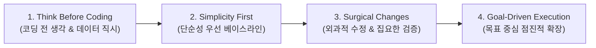

# Andrej Karpathy 개발 4원칙 (AIM 엔지니어링 가이드)

문서 번호: AIM-RULE-KARPATHY-001  
적용 범위: AIM 프로젝트 전체 (코드, 아키텍처, 데이터, 에이전트 워크플로우)  
기준: Andrej Karpathy Engineering Principles  

---

## 🏛️ 원칙 개요

안드레 카파시(Andrej Karpathy)의 엔지니어링 철학은 복잡한 시스템 개발 시 발생하는 **조기 최적화**, **가정에 기반한 버그**, **과도한 복잡성**을 방지하고 **확실한 동작성과 신뢰성**을 보장하기 위한 4대 절대 규칙입니다.

---

## 📌 4대 원칙 세부 실천 지침

### 1원칙. 코딩 전에 생각하라 (Think Before Coding & Inspect Data)
- **핵심 지침**:
  - 코드를 작성하기 전에 문제의 본질과 원시 데이터(Raw Data)를 직접 끝까지 확인합니다.
  - 가정을 명시적으로 밝히고, 무작정 추측하기보다 질문하여 명확히 파악합니다.
  - 혼란스럽거나 모호한 부분이 있다면 숨기지 말고 드러내어 잘못된 가정에서 비롯된 코딩을 사전에 차단합니다.
- **금지 사항**:
  - 데이터 스키마나 비즈니스 규칙을 상상이나 추측으로 먼저 정의하지 않습니다.
  - "이럴 것이다"라는 낙관적 가정에 기반하여 코드를 작성하지 않습니다.

### 2원칙. 단순성을 최우선으로 하라 (Simplicity First)
- **핵심 지침**:
  - 문제를 해결하는 가장 최소한의 코드(Minimal Viable Baseline)를 작성합니다.
  - 입력부터 출력까지 가장 단순한 형태로 데이터가 관통하는 엔드투엔드 파이프라인을 먼저 구축합니다.
  - 명확하고 직관적인 구현을 우선하며, 조기 추상화와 오버엔지니어링을 피합니다.
- **금지 사항**:
  - 필요성이 입증되지 않은 복잡한 라이브러리, 과도한 계층 분리, 미성숙한 분산 아키텍처를 도입하지 않습니다.

### 3원칙. 외과적으로 변경하고 집요하게 검증하라 (Surgical Changes & Verify Obsessively)
- **핵심 지침**:
  - 작업에 꼭 필요한 코드와 파일만 정밀하게 타겟팅하여 수정합니다 (외과적 정밀 타격).
  - 전체 시스템에 적용하기 전에 1~3개의 구체적인 단일 샘플/배치에 대해 100% 입증되는지 단위 테스트와 입출력 단언(Assertions)으로 확인합니다.
  - 기존의 코드 스타일, 네이밍 컨벤션, 주석을 존중하고 오직 자신이 수정한 부분에 대해서만 책임을 집니다.
- **금지 사항**:
  - 정상 동작하는 인접 코드를 임의로 리팩토링하거나 서식을 변경하지 않습니다.
  - 테스트되지 않은 코드를 "돌아가겠지"라는 기대로 통과시키지 않습니다.

### 4원칙. 목표 중심의 점진적 실행을 하라 (Goal-Driven & Progressive Iteration)
- **핵심 지침**:
  - 명확하고 측정 가능한 성공 기준(Success Criteria)을 작업 시작 전에 반드시 정의합니다.
  - 한 번의 스텝에서 단 한 가지 가설/변수/기능만 변경하고, 이전 베이스라인과 결과를 비교 검증합니다.
  - 성공 기준이 충족될 때까지 검증 루프(Test -> Evaluate -> Refine)를 독립적으로 반복합니다.
- **금지 사항**:
  - 여러 모듈이나 기능을 한 번에 대량으로 수정하지 않습니다.
  - 성공 기준에 대한 명확한 검증 없이 작업을 완료로 처리하지 않습니다.

---

## ✅ 작업 전/후 체크리스트

1. [ ] **[1원칙]** 요구사항 및 원시 데이터를 직접 검증하였는가? 가정이 명시되었는가?
2. [ ] **[2원칙]** 현재 구현이 문제를 해결하는 가장 단순하고 군더더기 없는 형태인가?
3. [ ] **[3원칙]** 필요한 부분만 외과적으로 수정하였는가? 단일 케이스 검증이 완료되었는가?
4. [ ] **[4원칙]** 정의된 성공 기준을 통과하였는가? 점진적으로 검증되었는가?
