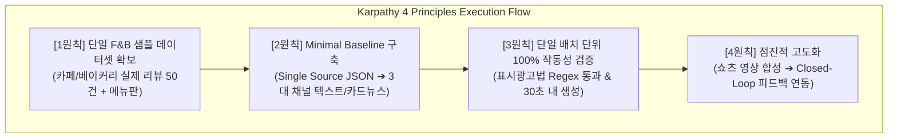

# AIM 플랫폼 기획 심층 검토 및 아키텍처 설계 회의록 (v1.0)

- **일시**: 2026-10-06
- **주제**: [AIM_Base.md](file:///Users/ssh/Documents/Develope/AIM/AIM_Base.md) 기반의 '올인원 마케팅 OS' 기획 분석 및 기술 타당성 검토
- **적용 원칙**: 안드레 카파시 개발 4원칙 (Karpathy Core Principles) & 헤르메스 자율 에이전트 프로토콜 (Hermes Protocol)
- **주재**: 총괄 관리자 (General Project Director, 33년 경력)

---

## 1. 30년+ 시니어 전문가 자문단 구성 및 역할

| 성명/역할 | 경력 | 핵심 전문 영역 | 본 회의 중점 검토 임무 |
| :--- | :---: | :--- | :--- |
| **총괄 관리자 (General Director)** | 33년 | 대규모 SDLC 총괄, IT 사업화 거버넌스, 엔터프라이즈 PMO | 전체 아키텍처 정합성, 카파시 4원칙 통제, MVP 범위 확정 |
| **수석 분산 아키텍트 (Chief Architect)** | 32년 | 분산 시스템, 대용량 트랜잭션, 이벤트 기반 파이프라인 | 온·오프라인 옴니채널 데이터 파이프라인 실현 가능성 검증 |
| **수석 AI/NLP 아키텍트 (Chief AI Architect)** | 31년 | 거대언어모델(LLM) 파이프라인, 프롬프트 엔지니어링, RAG | 5대 채널 원천 분기 생성 엔진(Atomization) 및 Closed-Loop 모델링 |
| **수석 보안/컴플라이언스 책임자 (CISO/Legal Tech)** | 30년 | 데이터 보안, 개인정보 비식별화, 광고 규제 법률 테크 | 표시광고법 검수 룰셋, PII 마스킹, 매체별 정책 리스크 통제 |
| **수석 엣지/커머스 통합 리드 (Chief Commerce Lead)** | 31년 | POS/결제 단말기 연동, 커머스 API 연동, 크롤링 엔진 | 오프라인 POS 및 영수증 리뷰/Q&A 수집의 기술적 현실성 검토 |
| **수석 프로덕트/UX 리드 (Chief Product UX)** | 30년 | B2B SaaS UX, 모바일 인터랙션, 프론트엔드 아키텍처 | 1인 소상공인 맞춤 '원클릭 대시보드' 및 실시간 프리뷰 최적화 |

---

## 2. [AIM_Base.md](file:///Users/ssh/Documents/Develope/AIM/AIM_Base.md) 기획 분석 요약

기획서는 1인 창업자 및 소상공인을 위한 **'에이전틱 AI 기반 올인원 마케팅 운영체제(Marketing OS)'**를 제안하고 있습니다.

1. **1단계 (입력)**: POS 결제/재고, 영수증 리뷰, 커머스 Q&A, SNS 댓글을 수집하고 NLP로 정규화하여 **Single Source of Truth DB** 구축.
2. **2단계 (가공)**: 기획 에이전트 및 5대 채널(블로그, 카카오톡, 인스타/틱톡, 유튜브 쇼츠, 커머스) 서브 에이전트가 맞춤형 글/에셋을 자동 분기 생성 (Atomization).
3. **3단계 (통제)**: 표시광고법 및 저작권을 사전 검수하는 컴플라이언스 에이전트와 **원클릭 승인 대시보드**.
4. **4단계 (학습)**: 온라인 반응 및 오프라인 POS 매출을 역추적하여 프롬프트를 자동 튜닝하는 **Closed-Loop 성과 피드백**.

---

## 3. 전문가 패널 심층 논의 및 날카로운 비판 (Debate & Findings)

### 🎙️ 1) 수석 엣지/커머스 통합 리드 (POS & 크롤링)
> **"기획서의 1단계 '온·오프라인 자동 수집'은 현업에서 가장 큰 난관에 부딪힙니다."**
- **현실적 병목**: 한국 시장의 POS는 OKPOS, 포스뱅크, 나이스 등 수십 개 벤더로 파편화되어 있으며 폐쇄망이 많아 직접 연동에 상당한 시일과 비용이 듭니다. 네이버 플레이스 영수증 리뷰 역시 공식 공개 API가 없어 스크래핑 시 캡차(CAPTCHA) 및 빈번한 DOM 변경 리스크가 큽니다.
- **카파시 1원칙(데이터 직시) 적용**:
  - 초기 버전부터 무리하게 폐쇄형 POS 하드웨어 API 연동을 고집하면 프로젝트가 표류합니다.
  - **대안**: 1단계 MVP에서는 **'스마트스토어/네이버 플레이스 공개 URL 입력 + 사업자 영수증/정산 내역 엑셀(CSV) 업로드 Fallback'** 구조로 입력 경로를 이중화해야 합니다.

### 🎙️ 2) 수석 분산 아키텍트 (데이터 파이프라인 & Single Source DB)
> **"비정형 데이터의 무결성을 보장하는 정규화 스키마(Canonical Schema)가 선행되어야 합니다."**
- 리뷰 텍스트, 결제 금액, SNS 댓글 등 이종(heterogeneous) 데이터를 무작정 LLM에 던지면 컨텍스트 낭비와 환각(Hallucination)이 발생합니다.
- **아키텍처 제언**:
  - `Raw Ingestion -> PII Masking -> Sentiment/Keyword Extraction -> Unified Business Profile JSON`의 4단 데이터 정제 파이프라인을 엄격히 규격화해야 합니다.
  - 이 `Unified Business Profile JSON`이 바로 기획서가 명시한 **Single Source of Truth**가 됩니다.

### 🎙️ 3) 수석 AI/NLP 아키텍트 (5대 채널 생성 엔진 & Closed-Loop)
> **"5개 채널 동시 렌더링과 비디오 합성은 조기 최적화(Overengineering)입니다."**
- 유튜브 쇼츠 영상 렌더링(TTS + 자막 + 영상 합성)과 복잡한 Closed-Loop 강화학습을 첫 스프린트에 넣는 것은 카파시 2원칙(Simplicity First)에 정면으로 위배됩니다.
- **카파시 2원칙(단순성 우선) 적용**:
  - **MVP 범위 압축**: 텍스트와 이미지 중심의 **3대 핵심 채널(네이버 블로그 롱폼, 인스타그램 캐러셀/피드 카피, 카카오톡 채널 단문 푸시)**부터 엔드투엔드로 관통시켜야 합니다.
  - 영상 제작(쇼츠)과 정교한 파라미터 자동 튜닝은 1단계가 검증된 후 2단계로 점진 확장(4원칙)해야 합니다.

### 🎙️ 4) 수석 보안/컴플라이언스 책임자 (표시광고법 & 개인정보)
> **"표시광고법 필터링은 단순 LLM 프롬프트가 아니라 '결정론적 룰 엔진(Deterministic Rule Engine)'과 결합해야 합니다."**
- LLM에게 "표시광고법을 위반하지 마라"고 지시하는 것만으로는 법적 책임을 면할 수 없습니다 (환각 가능성).
- **기술적 해결책**:
  - **하이브리드 검증기 (Two-Tier Guardrail)** 도입:
    1. **1차 룰베이스 필터**: 공정위 지정 금지 표현(예: '최고', '1위', '완치', '부작용 0%') Regex/사전 기반 즉각 차단.
    2. **2차 LLM 시맨틱 필터**: 문맥상 과장광고 및 미인증 허위 표기 판별.

### 🎙️ 5) 수석 프로덕트/UX 리드 (원클릭 대시보드)
> **"1인 소상공인은 복잡한 마케팅 용어를 모릅니다. 직관성이 생명입니다."**
- 대시보드는 5개 채널의 발행 결과를 한 화면에서 탭으로 전환하며 실제 발행 화면과 동일한 형태의 **WYSIWYG(위지윅) 프리뷰**를 제공해야 합니다.
- 수정하고 싶은 문장만 클릭하여 "더 친근하게", "더 간결하게" 등 원클릭 재생성이 가능해야 합니다.

---

## 4. 총괄 관리자(General Director) 최종 결론 및 Karpathy 4원칙 가이드라인

총괄 관리자로서 30년 이상의 경험을 바탕으로 본 프로젝트의 추진 방향을 다음과 같이 확정합니다.

### ✅ 확정된 성공 기준 (Success Criteria for Milestone 1)
1. **단일 샘플 완결성**: 구체적 1개 업종(예: 로컬 베이커리/카페) 데이터 1세트에 대해 100% 에러 없이 단일 원천 데이터 변환 완료.
2. **3대 채널 원천 생성**: 블로그 롱폼(Markdown), 인스타 캡션/해시태그, 카카오톡 단문 카피가 30초 이내에 자동 생성.
3. **컴플라이언스 무결성**: 표시광고법 금칙어가 포함된 테스트 케이스 10건에 대해 룰베이스 필터가 100% 사전 감지 및 수정 제안.
4. **원클릭 승인 UI**: 대시보드 프리뷰에서 단 1번의 클릭으로 발행 페이로드(JSON)를 정상 생성.

---

## 5. 차기 액션 아이템 (Next Action Items)

1. **Phase 1-1**: 단일 매장 검증용 샘플 데이터셋 스키마 및 가상 데이터셋(`sample_store_data.json`) 정의.
2. **Phase 1-2**: 단일 원천 정규화 모듈(`core/normalizer.py`) 및 표시광고법 룰 검증기(`core/compliance_guard.py`) Minimal Baseline 구현.
3. **Phase 1-3**: 3대 채널 분기 프롬프트 엔진 구축 및 단일 배치 E2E 파이프라인 검증.
