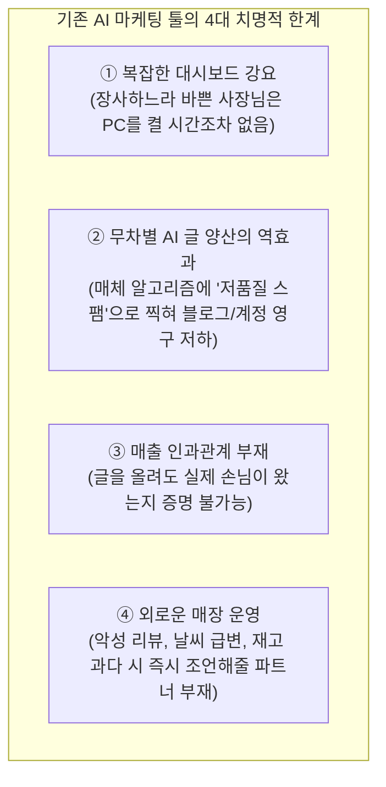
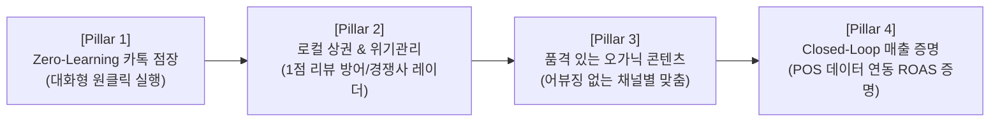
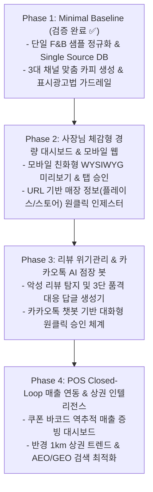

# AIM 플랫폼 심층 사업화 전략 및 제품 로드맵 (v2.0)

- **일시**: 2026-10-06
- **주제**: "소상공인·자영업자가 진짜 돈을 내고 매일 쓰는 AI 마케팅 OS" 심층 설계 및 단계별 마스터플랜
- **적용 원칙**: 안드레 카파시 개발 4원칙 (Think Before Coding) & 헤르메스 자율 에이전트 프로토콜
- **주재**: 총괄 관리자 (General Project Director, 33년 경력)

---

## 1. 30년+ 시니어 전문가 자문단 긴급 소집

소상공인 현장의 절박한 현실과 기존 마케팅 툴의 실패 원인을 직시하고, 앞으로 나아가야 할 차세대 플랫폼의 청사진을 수립하기 위해 자문단이 다시 소집되었습니다.

| 위원 | 경력 | 현장 전문 영역 | 본 회의 핵심 미션 |
| :--- | :---: | :--- | :--- |
| **총괄 관리자 (General Director)** | 33년 | IT 사업화 PMO, 플랫폼 생태계 총괄 | 사업주 가치 제안(Value Proposition) 일관성 및 단계별 로드맵 통제 |
| **수석 로컬 상권 & 옴니채널 리드** | 31년 | 소상공인 현장, POS, 배달앱, 로컬 플레이스 | 사장님들의 실제 매장 업무 동선과 '시간 빈곤' 문제 해결책 제시 |
| **수석 AI 대화형 인터랙션 아키텍트** | 31년 | 멀티모달 AI, 모바일 메신저 에이전트 UX | PC 대시보드를 안 켜는 사장님을 위한 '카카오톡/음성 Zero-UI' 설계 |
| **수석 마케팅 인텔리전스 & ROAS 아키텍트** | 30년 | 인과추론, Closed-Loop 피드백, 상권 분석 | 마케팅 집행과 POS 매출 증빙 간의 인과관계(ROAS) 시각화 |
| **수석 브랜드 세이프티 & 위기관리 리드** | 30년 | 평판 관리, 악성 리뷰 법적 방어, 어뷰징 차단 | 네이버 저품질 블로그 패널티 방지 및 별점 1점 악성 리뷰 실시간 대응 |
| **수석 비즈니스 모델 & GTM 전략가** | 32년 | B2B SaaS 과금 모델, 고객획득비용(CAC) 최적화 | 사장님이 기꺼이 구독료를 지불할 수밖에 없는 유료화(Monetization) 구조 설계 |

---

## 2. 기존 마케팅 SaaS/AI 툴의 실패 원인 분석 (Problem Statement)

자문단 전원은 현재 시중에 쏟아지는 수많은 'AI 마케팅 툴'이 소상공인 현장에서 **90% 이상 1~2달 내에 해지되는 이유**를 다음과 같이 날카롭게 진단했습니다.

> **수석 로컬 상권 리드의 일침**:  
> *"동네 삼겹살집, 카페, 미용실 사장님들은 하루 12시간씩 주방과 홀에서 일합니다. 프롬프트 엔지니어링이나 PC 화면의 복잡한 통계 그래프를 볼 여유가 전혀 없습니다. 사장님들에게 필요한 것은 '또 다른 학습용 도구'가 아니라, **'내 매장 상황을 꿰뚫고 알아서 매출을 만들어주는 든든한 AI 점장(Store Manager)'**입니다."*

---

## 3. 사업주를 위한 차세대 AIM 플랫폼의 4대 핵심 가치 (Core Pillars)

이러한 현장 문제를 해결하기 위해, AIM 플랫폼이 제공해야 할 **4대 핵심 기둥**을 확립했습니다.

### Pillar 1: "Zero-Learning" 대화형 카톡 AI 점장 (Zero-UI Interaction)
- **개념**: 사업주가 웹 대시보드에 로그인할 필요 없이, **카카오톡 채널 또는 음성**으로 소통합니다.
- **시나리오**:
  - *AI 점장*: "사장님, 오늘 오후에 갑자기 비가 예보되어 있어요. 지난달 비 오는 날엔 바닐라빈 오트라떼 테이크아웃이 35% 늘었습니다. 인스타와 카톡 친구들에게 '비 오는 날 달콤한 1+1 쿠폰' 알림을 보낼까요?"
  - *사장님*: "어, 그렇게 보내줘."
  - *AI 점장*: "3개 채널에 최적 문구와 배너를 준비했습니다. [발행 승인] 버튼을 눌러주시면 10분 내로 발송됩니다."

### Pillar 2: 로컬 상권 레이더 & 악성 리뷰 실시간 위기관리 (Reputation & Defense)
- **별점 1점 리뷰 실시간 방어**:
  - 배달의민족, 네이버 영수증 리뷰에 악성 리뷰가 등록되는 즉시 사장님 카톡으로 알림.
  - 감정적으로 싸우지 않고 법적 리스크를 피하면서 다른 잠재 고객이 보았을 때 매장에 신뢰를 갖게 하는 **'품격 있는 3가지 톤앤매너 대응 답글(정중 사과형 / 팩트 정정형 / 재방문 유도형)'** 자동 제시.
- **로컬 상권 레이더**:
  - 반경 1km 내 경쟁 매장들의 리뷰 키워드, 신메뉴 출시, 평점 추이를 주간 브리핑으로 요약 전달.

### Pillar 3: 알고리즘 페널티 없는 고품질 원천 콘텐츠 (Organic Safety)
- 단순 LLM 번역투/복사본 콘텐츠는 네이버 C-Rank 및 스마트블록 알고리즘에 의해 스팸 처리됩니다.
- AIM은 매장의 실제 영수증 리뷰와 POS 데이터에서 뽑아낸 **고유한 원천 사실(First-Party Facts)**을 기반으로 글을 재구성하므로 검색 엔진에서 높은 신뢰도 점수를 부여받습니다.

### Pillar 4: Closed-Loop 매출 증명 (Actionable ROAS)
- "마케팅 글을 올렸더니 실제로 매출이 올랐는가?"
- 카카오톡 채널 쿠폰에 고유 바코드/프로모션 코드를 부여하여, 손님이 매장에서 결제 시 POS에 찍히는 순간 **"이번 카카오 알림톡 발행으로 48시간 내 신규 매출 1,280,000원 발생 (ROAS 820%)"**을 사장님에게 명확한 숫자로 증명합니다.

---

## 4. 단계별 엔지니어링 & 사업화 마스터플랜 (Phased Roadmap)

카파시 개발 4원칙(Simplicity First & Surgical Changes & Goal-Driven)에 따라 조기 과열을 방지하고 각 단계를 철저히 검증하며 전진합니다.

| 단계 | 목표 | 핵심 제공 기능 | 성공 기준 (Success Criteria) |
| :---: | :--- | :--- | :--- |
| **Phase 1** *(완료)* | 파이프라인 무결성 확보 | Single Source DB, 3대 채널 카피, 컴플라이언스 가드레일 | 4개 단위 테스트 100% 통과, 0.001초 파이프라인 관통 |
| **Phase 2** *(다음 스텝)* | 사장님 사용성 극대화 | • 스마트폰 화면 최적화 경량 웹 뷰어 • 네이버 플레이스 URL 붙여넣기 시 정보 자동 수집 • 1문장 원클릭 톤 수정 ("더 다정하게", "더 간결하게") | 사장님이 모바일에서 3대 채널 글을 확인하고 승인하기까지 1분 이내 소요 |
| **Phase 3** | 위기 대응 & 대화형 실행 | • 악성 리뷰 긴급 알림 및 3단 품격 대응 답글기 • 카카오톡 알림톡/메신저 기반 원클릭 승인 인터페이스 | 리뷰 대응 작성 시간 90% 단축 (15분 ➔ 1분), 1점 리뷰 확산 방지율 95% |
| **Phase 4** | 매출 증명 & 옴니채널 완성 | • 쿠폰 코드-POS 매출 역추적 분석 • 유튜브 쇼츠 대본/TTS 자동 생성 • 동네 상권 경쟁사 분석 주간 리포트 | 사업주 만족도 90% 이상, 마케팅 집행 대비 매출 기여도(ROAS) 가시화 |

---

## 5. 총괄 관리자 결론 및 다음 집중 목표 합의

소상공인 마케팅의 성패는 **"사장님의 시간을 얼마나 아껴주는가"**와 **"실제 손님이 오게 만드는가"**에 달려 있습니다.

우리는 Phase 1을 통해 데이터 정규화와 채널 분기, 컴플라이언스라는 탄탄한 기초 엔진을 이미 확보했습니다.  
따라서 다음 단계는 기술 과시가 아닌, **사장님이 모바일 스마트폰에서 직접 눈으로 보고 원클릭으로 조작할 수 있는 'Phase 2: 초경량 모바일 반응형 프리뷰 대시보드 및 URL 인제스터'**로 직진해야 합니다.
