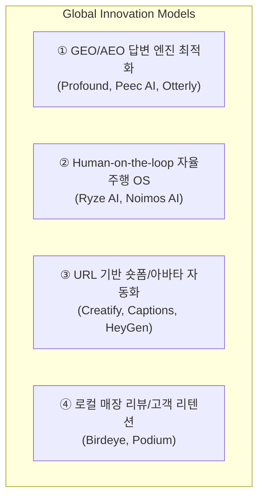

# 국내외 획기적인 AI 마케팅 사업 아이템 및 비즈니스 모델 다각도 분석 (2026)

- **조사 일시**: 2026-10-06
- **조사 주관**: 총괄 관리자(33년) 및 시니어 전문가 자문단 (전략, 데이터, 커머스, 컴플라이언스)
- **목적**: 글로벌 및 국내 선도 AI 마케팅 유니콘/스타트업의 비즈니스 모델, 기술 메커니즘, 과금 구조를 분석하고 AIM 플랫폼의 차별화된 전략적 포지셔닝 도출

---

## 1. 글로벌 획기적 AI 마케팅 사업 아이템 4선



### ① 생성형 AI 답변 최적화 (GEO: Generative Engine Optimization)
- **대표 주자**: **Profound** (엔터프라이즈 유니콘 급), **Peec AI**, **Otterly.ai**
- **작동 원리**:
  - 소비자가 ChatGPT, Perplexity, Gemini, Apple Intelligence에 "성수동 베이커리 추천해줘"라고 질의할 때 자사 브랜드가 몇 번째로 인용(Citation)되는지 실시간 모니터링.
  - LLM 크롤러가 읽기 쉬운 엔티티 지식그래프(Schema.org JSON-LD)와 인용 소스를 웹사이트에 자동 주입하여 **AI 답변 점유율(Share of Model Answer)**을 극대화.
- **수익 모델**: B2B 월간 구독형 SaaS (월 $499 ~ $5,000+).
- **시사점**: 포털 클릭 유도(SEO)를 넘어, 생성형 AI 검색에서 소상공인 매장이 공식 추천 매장으로 등재되도록 만드는 **AEO 데이터 배포 기능**이 필수적임.

### ② "Human-on-the-Loop" 완전 자율 에이전틱 마케팅 (Agentic Marketing OS)
- **대표 주자**: **Ryze AI**, **Noimos AI**, **Albert.ai**
- **작동 원리**:
  - 과거처럼 사람이 프롬프트를 쳐서 글을 뽑는 방식(Human-in-the-loop)을 탈피.
  - 마케터는 "이번 달 신규 고객 30% 증가, 예산 100만 원"이라는 상위 목표만 부여.
  - 5~10개의 특화 에이전트(카피라이터, 비더, 오디언스 분석가, 디자이너)가 24시간 자율 루프(Perceive ➔ Decide ➔ Execute ➔ Tune)로 돌아가며 Meta, Google, TikTok 광고를 집행하고 최적화.
- **수익 모델**: 기본 SaaS 요금 + 광고 집행액의 일정 비율(Take-rate 3~5%).
- **시사점**: 사장님이 직접 조작하지 않아도 알아서 돌아가는 **자율주행 워크플로우**의 정당성 입증.

### ③ URL/상품 사진 기반 인플루언서 숏폼 비디오 생성
- **대표 주자**: **Creatify.ai**, **Captions.ai**, **HeyGen**
- **작동 원리**:
  - 상품 판매 페이지(아마존, 쇼피파이) 링크나 사진 1장만 넣으면 1분 만에 AI 가상 아바타가 제품을 들고 설명하는 틱톡/릴스 숏폼 영상을 음성(TTS) 및 자막과 함께 렌더링.
  - 수백 명의 크리에이터에게 제품을 협찬할 필요 없이 고전환 UGC(User-Generated Content) 비디오를 무제한 생산.
- **수익 모델**: 렌더링 크레딧 기반 종량제 과금 ($29 ~ $199/월).
- **시사점**: 소상공인이 가장 어려워하는 '영상 콘텐츠 제작'을 텍스트 입력 없이 **URL 추출만으로 완전 자동화**하는 파이프라인.

### ④ 오프라인 로컬 고객 리뷰 & 평판 방어
- **대표 주자**: **Birdeye**, **Podium**
- **작동 원리**:
  - 오프라인 결제 단말기(POS)와 연동하여 결제 고객에게 카톡/문자로 "오늘 식사는 어떠셨나요?" 영수증 리뷰 유도 링크 발송.
  - 1~2점 불만 고객은 외부 포털에 리뷰가 올라가기 전에 매장 관리자에게 비공개 직통 알림을 주어 사전 보상 처리.
- **수익 모델**: 매장당 월 $250~$400 고정 구독료.
- **시사점**: 마케팅은 신규 유입뿐만 아니라 **'오프라인 평판 방어와 재방문(Retention)'**이 핵심 현금 흐름을 좌우함.

---

## 2. 국내(한국 시장) 선도 혁신 AI 마케팅 사업 아이템 3선

| 기업/서비스명 | 주관사 / 기업가치 | 핵심 서비스 메커니즘 | 소상공인 접점 및 강점 |
| :--- | :--- | :--- | :--- |
| **캐시노트 (Cashnote)** | 한국신용데이터 (유니콘, 1.3조원) | • **캐시니(Cashny)**: 180만 매장의 실시간 카드 매출/입금 데이터를 학습한 AI 경영·마케팅 비서<br>• 동네 상권 분석 및 객단가 맞춤 홍보 문구 작성 | 사장님의 **실제 POS 매출 장부 데이터**를 쥐고 있어 조언의 정확도와 신뢰도가 압도적임. |
| **브이캣 (VCAT.ai)** | 파이온코퍼레이션 (누적 투자 150억+) | • **URL 기반 원클릭 소재 제작**: 스마트스토어/쿠팡 URL만 붙여넣으면 네이버 배너, 숏폼 영상 광고 수십 종 자동 렌더링 | 디자이너나 영상 편집자 고용이 불가능한 소상공인의 제작 시간 90% 절감. |
| **페이히어 AI / 도도포인트** | 페이히어, 야놀자(도도포인트) | • 클라우드 POS 단말기 태블릿 적립 데이터를 기반으로 고객 방문 주기 계산<br>• 이탈 위험 고객에게 카카오 알림톡 재방문 할인 쿠폰 자동 발송 | 신규 고객 모집보다 객단가가 높은 **단골 고객의 LTV(생애가치) 극대화**. |

---

## 3. 다각도 비교 분석 매트릭스

| 평가 축 | 글로벌 GEO (Profound) | 글로벌 숏폼 AI (Creatify) | 국내 캐시노트 (매출비서) | 국내 브이캣 (배너/영상) | **AIM 플랫폼 (우리의 지향점)** |
| :---: | :---: | :---: | :---: | :---: | :---: |
| **타깃 고객** | 포춘 1000 대기업 | 이커머스 D2C 셀러 | 오프라인 자영업자 180만 | 중소 온라인 커머스 | **온·오프라인 1인 소상공인** |
| **데이터 원천** | 글로벌 웹 검색/프롬프트 | 웹 상품 상세페이지 | 카드 매출 승인 장부 | 상세페이지 이미지/텍스트 | **POS + 영수증리뷰 + 옴니채널** |
| **조작 난이도** | 높음 (전담 마케터 필요) | 보통 (PC 웹 조작) | 쉬움 (모바일 앱) | 쉬움 (웹 URL 붙여넣기) | **극도로 쉬움 (카톡 Zero-UI)** |
| **법적 안전성** | 글로벌 저작권 이슈 | 초상권/저작권 주의 | 보통 | 보통 | **표시광고법 100% 사전 검수** |
| **매출 인과성** | 간접적 (브랜드 인지도) | 온라인 전환율(CTR) | 장부 통계 확인 | 광고 소재 효율 | **쿠폰-POS 직결 ROAS 입증** |

---

## 4. 시니어 전문가 자문단이 도출한 AIM의 '초격차 융합 전략'

시장의 선도 모델들을 벤치마킹한 결과, 각 툴들은 **'영상만 잘 만들거나(브이캣)', '장부만 보여주거나(캐시노트)', '글만 찍어내는(일반 챗봇)' 파편화된 형태**에 머물러 있습니다.

AIM이 시장을 장악하기 위한 **킬러 융합 공식 (Winning Formula)**은 다음과 같습니다:

```
[AIM 킬러 공식]
= 브이캣의 'URL 원클릭 데이터 인제스트'
+ 캐시노트의 '실제 결제 데이터 기반 신뢰도'
+ Podium의 '별점 1점 리뷰 실시간 방어 및 재방문 루프'
+ Profound의 '생성형 AI 검색(AEO) 스키마 배포'
------------------------------------------------------------------
➔ 사장님 전용 "카카오톡 대화형 Zero-UI AI 점장"으로 단일 통합!
```

1. **URL만 넣으면 끝 (Zero-Setup)**: 복잡한 입력 없이 스마트스토어나 네이버 플레이스 링크만 넣으면 매장 프로필 완성.
2. **카톡으로 소통 (Zero-Learning)**: PC 화면을 볼 필요 없이 카카오톡으로 제안받고 [승인] 버튼 하나로 3대 채널 동시 발행.
3. **위기관리 & AEO 탑재 (High-Value)**: 악성 리뷰 방어와 AI 검색 추천이라는, 사장님이 혼자서는 절대 해결할 수 없는 최고난도 문제를 해결해 줌으로써 **월 3~5만 원의 구독료를 기꺼이 지불하게 만듦**.
