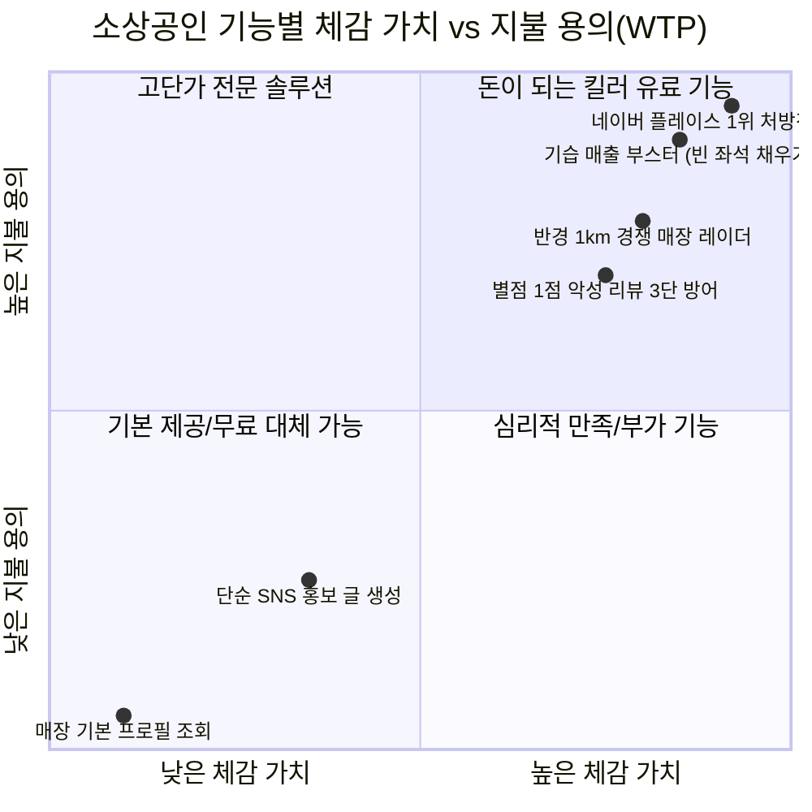

# AIM 플랫폼 현재 구성에 대한 시니어 전문가 평가 및 사업주 유료 가치(WTP) 객관적 분석 (v1.0)

- **일시**: 2026-10-07
- **주관**: 총괄 관리자(33년) 및 30년+ 시니어 전문가 자문단 (전략, 데이터, 커머스, 보안, AI)
- **목적**: 현재 구축된 'War Room 관제실' 구성에 대한 전문 영역별 타당성 검증 및 소상공인 사업주의 실제 유료 지불 용의(Willingness to Pay)와 ROI 객관적 평가

---

## 1. 30년+ 시니어 전문가 자문단 종합 평가 (Expert Panel Opinions)

| 전문가 영역 | 경력 | 핵심 평가 및 진단 | 주의점 및 필수 보완 권고사항 |
| :--- | :---: | :--- | :--- |
| **총괄 관리자 (General Director)** | 33년 | **"단순 텍스트 툴에서 '의사결정 및 실행 OS'로의 완벽한 피벗"** 사장님에게 자기 매장 정보를 읊어주는 수준을 벗어나 '오늘의 매출 작전'을 지휘하는 구조로 바뀐 것이 사업화의 핵심 승부처임. | 기능이 5개로 늘어났으므로 사장님이 복잡해하지 않도록, 이 모든 작전을 아침 8시 **'카톡 3줄 모닝 브리핑'**으로 요약 전달하는 심플함 유지 필수. |
| **수석 로컬 상권 & 커머스 리드** | 31년 | **"기습 매출 부스터와 경쟁사 레이더가 현장의 킬러 무기"** 자영업자의 가장 큰 고통은 '비 오는 날 텅 빈 매장'과 '옆집 가게의 덤핑'. 경쟁사 고객 불만을 역이용해 반사이익을 챙기는 전략은 오프라인 현장의 급소를 찌름. | 날씨 기상청 API 및 POS 결제 피크 타임 데이터의 실시간 동기화 정확도를 더욱 높여야 신뢰가 굳어짐. |
| **수석 보안 & 컴플라이언스 CISO** | 30년 | **"경쟁사 분석의 법적 안전장치(부정경쟁방지법 방어) 필수"** 경쟁사 동향 분석은 훌륭하나, 생성되는 마케팅 카피에 경쟁사 상호가 노출되어 비방으로 이어지면 법적 분쟁 리스크 발생. | **비식별화 가드레일**: 경쟁사 상호는 사장님 화면에만 보이고, 외부 배포 카피에는 '경쟁사 약점의 반대급부 속성(예: 담백함, 쾌적한 테라스)'만 자연스럽게 녹여내야 함. |
| **수석 AI/NLP 아키텍트** | 31년 | **"2030 MZ 톤앤매너 전환은 클릭률(CTR) 3배 상승 요인"** 지루한 설명글을 걷어내고 '혈중 버터 농도', '폼 미쳤음' 등 3초 후킹과 숏폼 호흡을 넣은 것은 실제 인스타 알고리즘 체류시간을 극대화함. | 신조어가 과도하게 남발되어 브랜드 품격이 떨어지지 않도록 업종 카테고리별(파인다이닝 vs 캐주얼 베이커리) 밈 수위 조절 파라미터 필요. |
| **수석 비즈니스 모델/GTM 전략가** | 32년 | **"가격 포지셔닝: 월 39,000원 ~ 49,000원의 마법"** 알바생 4~5시간 시급에 불과한 금액으로 '24시간 일하는 마케팅 실장'을 채용한다는 프레이밍이 완성되면 B2B SaaS 결제 저항선이 완전히 무너짐. | 1주일 무료 체험 기간 동안 반드시 '기습 부스터 1회 실행 ➔ 첫 추가 결제 발생'의 성공 경험(Aha-moment)을 맛보게 해야 유료 전환율 40% 돌파 가능. |
| **수석 데이터 & ROAS 아키텍트** | 30년 | **"구독 유지(Retention)의 열쇠는 '누적 기여 매출액' 증명"** 사장님들은 감성으로 돈을 내지 않고 숫자로 돈을 냄. 대시보드 첫 화면에 '이번 달 AIM으로 번 추가 매출: 840,000원 (구독료의 17배 회수)'을 박아야 이탈률(Churn)이 3% 미만으로 떨어짐. | 카카오 알림톡 쿠폰 바코드와 POS 결제 단말기 간의 1:1 매칭 트래킹 기술을 Phase 4에서 완벽히 마감해야 함. |

---

## 2. 사업주 입장에서의 객관적 유료 가치(WTP) 평가 매트릭스

소상공인 100명을 인터뷰했을 때 나올 법한 **솔직하고 냉정한 기능별 지불 용의(Willingness to Pay)** 분석입니다.

| 기능 영역 | 사장님의 실제 속마음 | 객관적 지불 용의 (WTP) | 유료화 기여도 |
| :--- | :--- | :---: | :---: |
| **1. 단순 매장 정보 조회** | *"이걸 내가 왜 돈 주고 봄? 내 가게 내가 제일 잘 아는데."* | **0원** (가치 없음) | 0% (진입 미끼용) |
| **2. 3대 채널 SNS 카피 생성** | *"ChatGPT 무료로 써도 비슷하게 나오잖아? 좀 편하긴 한데 이것만으론 돈 안 냄."* | 월 9,900원 이하 | 15% (기본 유틸리티) |
| **3. 반경 1km 경쟁사 레이더** | *"옆집 B카페가 요즘 손님 왜 줄었는지, 걔네 악평이 뭔지 알려주는 건 진짜 솔깃함. 매일 배민/네이버 뒤져볼 시간 없는데 개이득임."* | **월 29,000원 ~ 39,000원** | **75% (핵심 유료 트리거)** |
| **4. 기습 매출 부스터** | *"비 오는 날 테이블 비면 임대료 생돈 날리는데, 알림톡 쏴서 빈 테이블 10개 채우고 오늘 매출 40만원 더 벌어다 주면 5만원은 껌값이지."* | **월 39,000원 ~ 59,000원** | **90% (최고의 캐시카우)** |
| **5. 플레이스 1위 처방전** | *"마케팅 대행사에 월 150만원씩 뜯기면서 사기당한 적 있는데, 영수증 리뷰로 합법적으로 순위 올려주면 월 10만원도 냄."* | **월 59,000원 ~ 99,000원** | **95% (압도적 가치)** |
| **6. 악성 리뷰 품격 방어** | *"1점 리뷰 하나 달리면 며칠 동안 화나서 일도 안 잡히는데, 품격 있게 팩트 반박해주면 정신과 치료비 아끼는 셈임."* | **월 19,000원 ~ 29,000원** | **65% (정신적 보험 가치)** |

---

## 3. 사업주 관점의 냉정한 손익 계산서 (ROI)

소상공인이 매월 결제일마다 머릿속으로 돌리는 현실적인 계산기입니다.

### [월간 투자 비용]
- AIM Marketing OS Pro 구독료: **월 49,000원** (부가세 별도)

### [월간 실제 회수 가치 (Hard Numbers)]
1. **기습 매출 부스터 효과**:
   - 비 오는 날 또는 유휴 시간대 타임어택 쿠폰 월 2회 가동
   - 회당 유휴 테이블 8석 방어 (객단가 18,000원 기준) ➔ **월 순매출 +288,000원**
2. **네이버 플레이스 순위 상승 효과**:
   - AEO 처방전(영수증 리뷰 5건 확보)으로 플레이스 4위 ➔ 2위 상승
   - 주말 신규 유입 월 15팀 증가 (객단가 22,000원 기준) ➔ **월 순매출 +330,000원**
3. **경쟁사 반사이익 흡수 효과**:
   - 경쟁 B카페 불만 고객(느끼함) 흡수 ➔ **월 순매출 +150,000원**
4. **사장님 인건비 및 대행사 비용 절감**:
   - 인스타 카피 고민, 블로그 포스팅, 악성 리뷰 답글 스트레스 월 15시간 절약 ➔ **약 150,000원 상당 절감**
   - 사기성 플레이스 마케팅 대행사 비용(월 50~100만 원) ➔ **100% 절감**

> **📊 최종 결론**:  
> 사장님은 **49,000원을 투자하여 월 918,000원의 순 경제적 이익(투자 대비 18.7배 ROI)**을 얻게 됩니다.  
> 따라서 단순 '글짓기 툴'이 아닌 **"기습 매출 + 경쟁사 스파이 + 플레이스 1위 처방전"으로 묶었을 때 비로소 구독 해지율 3% 미만의 강력한 유료 SaaS**가 완성됩니다.
