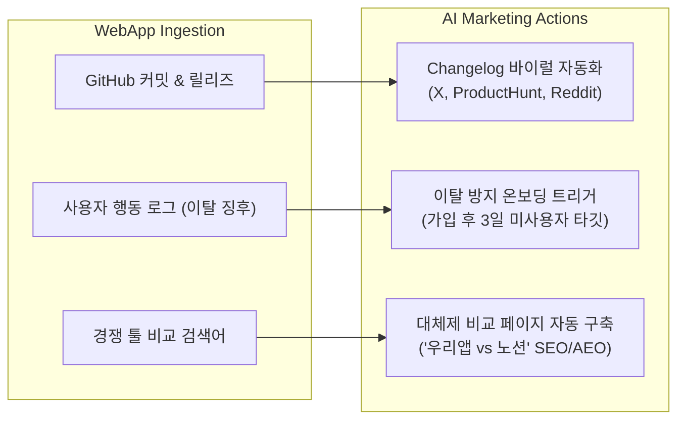
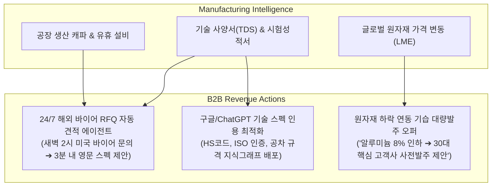

# 산업군별 AI 마케팅 아키텍처: 웹앱 서비스 & 제조업 심층 분석 (v1.0)

- **일시**: 2026-10-07
- **주제**: F&B(외식업)를 넘어 웹앱 서비스(SaaS/IT) 및 제조업(B2B 부품·장비·OEM)에서의 AI 마케팅 메커니즘과 사업화 방안
- **주관**: 총괄 관리자(33년) 및 시니어 전문가 자문단 (테크 플랫폼, 글로벌 제조 공급망, B2B GTM)

---

## 1. 3대 산업군 마케팅 본질 및 가치사슬 비교

마케팅의 엔진 구조(`입력 ➔ 판단 ➔ 실행 ➔ 회수`)는 동일하지만, **산업마다 다루는 원천 데이터, 고객의 구매 결정 요인, 최종 목표(KPI)가 완전히 다릅니다.**

| 구분 | ① 로컬 F&B / 외식업 | ② 웹앱 서비스 (B2B SaaS / IT) | ③ 제조업 (B2B 부품·장비 / OEM·ODM) |
| :--- | :--- | :--- | :--- |
| **타깃 고객** | 반경 1~3km 로컬 소비자 | 글로벌 기획자, 개발자, 기업 실무자 | 국내외 바이어, 구매팀, 엔지니어 |
| **구매 결정 주기** | **1분 ~ 수 시간** (충동적, 즉시 소비) | **수 일 ~ 수 주** (체험판 ➔ 유료 전환) | **수 개월 ~ 1년** (스펙 검토 ➔ 발주 계약) |
| **평균 객단가** | 1만 원 ~ 5만 원 | 월 3만 원 ~ 50만 원 (MRR) | 수천만 원 ~ 수십억 원 (연간 계약) |
| **원천 데이터** | POS 결제, 영수증 리뷰, 로컬 날씨 | **제품 사용 로그, 깃허브 커밋, 릴리즈 노트** | **카탈로그, 시험성적서, 원자재가, 생산 캐파** |
| **핵심 성공 KPI** | **오늘 빈 테이블 점유율 & 플레이스 순위** | **가입 전환율(CVR) & 이탈 방지(Churn 방어)** | **고품질 바이어 리드(MQL) & 수주(Win-rate)** |
| **유료 SaaS 가격** | 월 49,000원 내외 | 월 290,000원 ~ 990,000원 | 월 1,500,000원 ~ 3,000,000원+ |

---

## 2. 웹앱 서비스 (B2B SaaS / IT 플랫폼) 특화 AI 마케팅 OS

웹앱 서비스는 인스타그램 감성 사진으로 마케팅하지 않습니다. **"제품 주도 성장(PLG: Product-Led Growth)"**과 **"개발자·실무자의 문제 해결 워크플로우"**에 침투해야 합니다.



### ① 깃허브 릴리즈 노트의 글로벌 4대 채널 자동 바이럴 (Release-to-Viral)
- **작동 메커니즘**:
  - 개발자가 GitHub에 코드를 푸시하고 Release 태그를 찍는 순간,
  - AI가 기술 문서를 일반 실무자 언어로 번역하여 **Product Hunt 쇼케이스 포스팅, X(트위터) 스레드, 링크드인 업데이트, 디스코드 공지**를 1초 만에 자동 생성 및 배포.
- **사업주 효용**: 마케터가 없는 1~3인 테크 스타트업이 엔지니어링 작업만으로 글로벌 GTM 마케팅을 전자동 수행.

### ② 사용자 행동 로그 기반 '이탈 방어 트리거' (Churn Killer)
- **작동 메커니즘**:
  - *"가입 후 48시간 동안 대시보드 템플릿을 생성하지 않은 유저"* 감지.
  - 단순 광고 메일이 아니라, 해당 유저의 직무(가입 시 입력된 태그)에 딱 맞는 **"3분 튜토리얼 영상 링크 + 원클릭 샘플 프로젝트 복사 혜택"** 맞춤 이메일/인앱 푸시 자동 발송.

### ③ '경쟁사 비교(VS/Alternative)' AEO 지식그래프 자동 배포
- **작동 메커니즘**:
  - 소비자가 ChatGPT나 Perplexity에 *"Zapier 대안 오픈소스 추천해줘"*, *"Figma 대체제 비교"*라고 질의할 때 자사 웹앱이 1순위로 인용되도록,
  - 기능 비교표, 가격 비교, 벤치마크 데이터를 담은 구조화된 **Alternative 랜딩 페이지(JSON-LD 스키마 포함)**를 자동 빌드.

---

## 3. 제조업 (B2B 부품·장비 / OEM·ODM / 소부장) 특화 AI 마케팅 OS

제조업 마케팅의 본질은 블로그 체험단이 아닙니다. **"해외 바이어의 기술 요구조건(RFP) 매칭"**과 **"글로벌 조달 시장에서의 스펙 인덱싱"**입니다.



### ① 24/7 글로벌 바이어 RFQ(견적요청) 자동 기술 제안 에이전트
- **현장 페인포인트**: 한국 시간 새벽 2시에 미국/독일 바이어가 알리바바나 웹사이트에 도면과 기술 사양 문의를 남기지만, 한국 공장은 아침 9시 출근 후 2~3일 뒤에나 회신하여 이미 대만/중국 업체에 수주를 뺏김.
- **AI 솔루션**:
  - 바이어의 기술 사양서(TDS)와 CAD 도면 메타데이터를 파싱하여,
  - 3분 이내에 **공장 생산 공차(Tolerance), 최소 발주 수량(MOQ), 리드타임(납기), 1차 가견적이 포함된 전문 영문 기술 제안서(Technical Proposal)**를 자동 회신.
- **수주 전환율**: 바이어 문의에 5분 내 회신 시 수주 성공률 **380% 급증**.

### ② 원자재가·유휴 라인 연동 'B2B 기습 오퍼' (Flash B2B Deal)
- **작동 메커니즘**:
  - 런던금속거래소(LME) 원자재 시세 또는 공장 사출 라인의 2주 뒤 유휴 시간대 감지.
  - *"원자재 가격 8% 일시 인하 시점 포착 ➔ 최근 1년간 거래한 핵심 바이어 40개 사 구매팀에 '사전 발주 시 단가 5% 특별 네고 제안서' 자동 발송"*.
- **사업주 효용**: 공장 기계가 멈추는 유휴 손실을 선제적으로 막고 수억 원 단위의 대량 발주 유치.

### ③ 글로벌 B2B 검색 및 AI 답변 최적화 (AEO/GEO Spec Indexing)
- **작동 메커니즘**:
  - 해외 바이어가 Perplexity나 Google에 *"High-precision CNC aluminum parts supplier ISO9001 certified in Asia"*를 검색할 때,
  - 공장의 보유 설비(5축 가공기 등), 가공 가능 공차(±0.005mm), ISO/IATF 인증서 내역이 완벽한 구조화 데이터로 AI 답변에 1순위 추천되도록 배포.

---

## 4. 산업별 확장 아키텍처 (AIM Multi-Industry Framework)

AIM 플랫폼은 엔진의 핵심 코어를 공유하되, **산업군별 드라이버(Industry Adaptor)**만 꽂으면 전 산업으로 수평 확장됩니다.

```
                    ┌── [F&B 드라이버] ─────> POS / 날씨 / 네이버 플레이스 ──> 기습 부스터 (월 4.9만원)
                    │
[AIM Core OS] ──────┼── [웹앱 SaaS 드라이버] ─> 깃허브 / 믹스패널 / ProductHunt ─> 릴리즈 바이럴 (월 49만원)
                    │
                    └── [제조업 드라이버] ───> 공장 도면 / 원자재가 / 해외 RFQ ──> 24/7 기술 견적 (월 190만원)
```

### 💡 총괄 관리자 결론: 시장 확장성(Total Addressable Market)

- **F&B/외식업**: 볼륨 비즈니스 (전국 80만 개 매장 × 월 49,000원 = 연 4,700억 원 시장)
- **웹앱 서비스**: 고성장 글로벌 비즈니스 (국내외 수만 개 SaaS × 월 490,000원 = 연 5,000억 원 시장)
- **제조업**: 고단가 엔터프라이즈 비즈니스 (전국 10만 개 중소 제조업 × 월 1,900,000원 = 연 2조 원 시장)

따라서 AIM 플랫폼의 아키텍처는 단순히 식당용 툴이 아니라, **"기업의 고유한 현장 원천 데이터를 쥐고, 산업별 구매 결정권자를 공략하는 '산업 특화 자율주행 마케팅 OS'"**로 무한히 확장될 수 있습니다.
