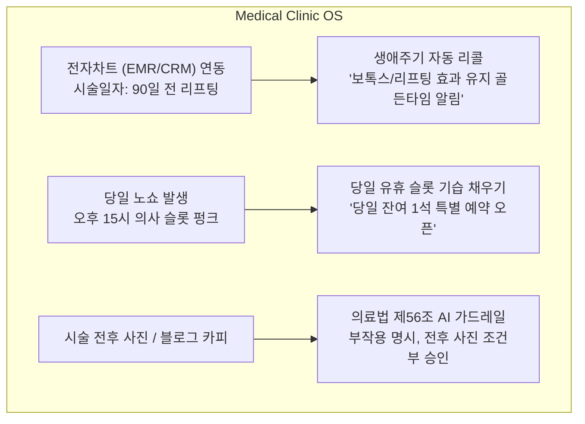
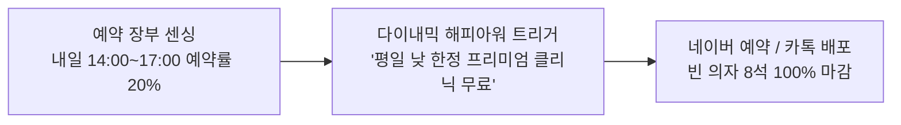

# 라이프스타일 서비스·전문직·리테일 산업 AI 마케팅 아키텍처 (v1.0)

- **일시**: 2026-10-07
- **대상 업종**: 피부과·성형외과(의료), 미용실·바버샵·네일(뷰티), 셀렉트샵·팝업·소매(판매샵), 피트니스·필라테스(회원제 매장)
- **주관**: 총괄 관리자(33년) 및 시니어 전문가 자문단 (의료법/컴플라이언스, 뷰티/리테일 CRM, 옴니채널 커머스)

---

## 1. 업종별 마케팅 본질 및 핵심 병목(Bottleneck) 분석

이 업종들은 단순한 '홍보'가 아니라 **"예약 스케줄 최적화(Capacity Management)"**, **"생애주기 재방문 리콜(Retention CRM)"**, **"엄격한 규제 준수(Compliance)"**가 사업의 성패를 가릅니다.

| 업종 카테고리 | 핵심 고객 행동 특성 | 현장 최대 병목 (Pain Point) | AI 마케팅 킬러 솔루션 |
| :--- | :--- | :--- | :--- |
| **① 피부과 / 에스테틱 (메디컬 뷰티)** | • 객단가 높음 (10만~200만 원) • 시술 주기 명확 (30~90일) • 신뢰도·부작용 극도 중시 | **의료법 위반 리스크 (영업정지 공포)** & 노쇼(No-Show) 발생 시 의사 유휴 손실 | • **의료법 제56조 100% 사전 차단 가드레일** • **시술 주기 맞춤 자동 리콜 알림톡** • 당일 노쇼 빈자리 타임어택 슬롯 채우기 |
| **② 미용실 / 바버샵 / 네일 (헤어·뷰티)** | • 디자이너 지정제 • 컷(4주), 펌/염색(8~12주) 주기 • 비주얼 포트폴리오 중심 | **평일 낮(13~17시) 유휴 의자(빈 좌석)** & 디자이너 퇴사 시 고객 이탈 | • **유휴 시간대 '해피아워' 기습 예약 부스터** • **Before/After 프라이버시 마스킹 숏폼** • 주기 도래 고객 자동 예약 넛지 |
| **③ 판매샵 / 셀렉트샵 (오프라인 소매)** | • 신상품·트렌드 민감 • 계절/재고 회전율 중요 • 단골 취향 기반 큐레이션 | **시즌 오프 시 재고 적체** & 매장 방문객 객단가 정체 | • **취향 세그먼트별 1:1 신상 큐레이션** • **재고 소진 타임어택 게릴라 할인** • 스마트스토어-오프라인 매장 재고 연동 |
| **④ 피트니스 / 필라테스 (회원제 매장)** | • 3개월~1년 정기권 • 출석률과 재등록률 비례 • 동기부여(Motivating) 중시 | **만료 시점 이탈(Churn)** & 등록 후 2주 차 결석 급증 | • **만료 14일 전 재등록 골든타임 프로모션** • **장기 미출석 회원 안부 & 복귀 혜택 넛지** • 1회 무료 체험권 네이버 플레이스 연동 |

---

## 2. 피부과·메디컬 에스테틱: "월 수천만 원 마케팅비의 혁신"

피부과는 마케팅 예산이 가장 크지만, **의료법 제56조(과대광고, 치료효과 보장, 환자 유인·알선 금지)** 때문에 가장 큰 스트레스를 받습니다.

### ① 의료법 전문 AI 가드레일 (Medical Legal Tech)
- **금지 표현 실시간 탐지**: "부작용 전혀 없음", "완벽 개선", "국내 최고 실력", "100% 보장", "파격 덤핑 할인" 등 적발 시 즉각 대안 의학 전문 용어로 자동 순화.
- 필수 명시 항목(부작용 고지 문구, 심의 번호 등) 자동 삽입.

### ② 시술 주기 기반 골든타임 리콜 CRM (LTV 극대화)
- 보톡스(3~4개월), 스킨부스터(4주), 색소레이저(2주) 등 환자별 시술 주기를 계산.
- *"고객님, 지난 레이저 시술 후 4주가 지났습니다. 색소 침착 예방을 위한 진정 케어 골든타임입니다."* 맞춤 카톡 자동 발송 ➔ **재방문율 45% 상승**.

---

## 3. 미용실·바버샵·네일: "빈 의자를 없애는 다이내믹 예약 부스터"

미용실의 가장 큰 고통은 주말엔 손님이 넘치고, **화·수·목요일 오후 2시~5시에는 디자이너들이 놀고 있는 것(Capacity Imbalance)**입니다.

### ① 다이내믹 타임슬롯 부스터 (Dynamic Slot Filling)
- 항공권/호텔의 '다이내믹 프라이싱'처럼, AI가 내일 오후의 예약 빈자리를 감지하여 **"평일 낮 2시~5시 방문 고객 한정 모발 클리닉 업그레이드 쿠폰"**을 인근 고객에게 집중 노출하여 고정비(임대료/인건비) 손실 방어.

### ② 4~6주 헤어 사이클 자동 넛지
- 남성 컷(3~4주), 여성 펌/염색(8~10주) 주기 도래 시점에 *"스타일이 무거워지셨을 타이밍입니다. 담당 디자이너의 이번 주 예약 현황 확인하기"* 1:1 맞춤 알림 발송.

---

## 4. 판매샵·오프라인 소매 매장: "재고 소진 & 단골 큐레이션"

오프라인 셀렉트샵, 패션/소품샵, 라이프스타일 스토어는 **재고 회전율**이 현금 흐름의 핵심입니다.

- **시즌 오프 기습 플래시 세일**: 남은 재고 15벌 감지 ➔ 당근마켓 동네생활 + 인스타 스토리로 **"오늘 단 하루, 라스트 피스 40% 타임어택"** 즉시 배포.
- **취향 기반 VIP 큐레이션**: 지난달 우드 향수를 구매한 고객 30명에게만 **"새로 입고된 우디 캔들 신상 프리오더 안내"** 핀포인트 전송.

---

## 5. 산업별 특화 기능 및 요금제 체계 (Tiered Packaging)

| 산업 패키지 | 핵심 차별화 엔진 | 타깃 시장 규모 | 권장 구독료 |
| :--- | :--- | :--- | :--- |
| **F&B 외식업** | 날씨 기습 부스터, 영수증 리뷰, 플레이스 1위 | 전국 80만 개 식당/카페 | **월 49,000원** |
| **뷰티 & 살롱** | 4주 사이클 리콜, 다이내믹 빈 의자 채우기, 릴스 템플릿 | 전국 15만 개 미용실/네일/바버 | **월 99,000원** |
| **메디컬 에스테틱** | 의료법 철통 가드레일, 시술별 골든타임 리콜, 노쇼 방어 | 전국 3만 개 피부과/성형/치과 | **월 290,000원 ~ 490,000원** |
| **B2B 제조업** | 24/7 글로벌 RFQ 견적 응답, 원자재가 기습 오퍼 | 전국 10만 개 중소 제조공장 | **월 1,500,000원 ~ 2,500,000원** |

### 💡 총괄 관리자 결론

> **"식당, 미용실, 피부과, 공장 모두 겉모습은 다르지만,  
> 결국 '유휴 자원(빈 테이블, 빈 의자, 빈 진료실, 빈 기계)을 실시간으로 감지해 채우는 엔진'이라는 본질은 정확히 일치합니다."**

AIM 플랫폼은 이미 구축된 코어 엔진 위에 **[의료법 가드레일], [예약 주기 CRM], [다이내믹 슬롯 채우기]**라는 전문 산업별 모듈을 확장함으로써, 자영업 전 업종을 지배하는 **진짜 마케팅 운영체제(Universal Marketing OS)**로 진화할 수 있습니다.
