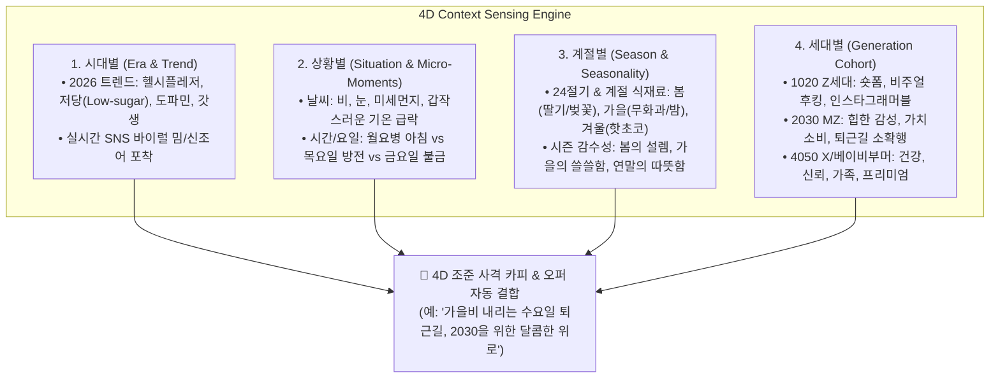

# 4차원 실시간 컨텍스트 마케팅 엔진 (4D Context Engine) 심층 분석 (v1.0)

- **일시**: 2026-10-07
- **주제**: 시대별(Trend) × 상황별(Situation) × 계절별(Season) × 세대별(Generation) 실시간 교차 지능 아키텍처
- **주관**: 총괄 관리자(33년) 및 시니어 전문가 자문단 (소비자 심리, 빅데이터 알고리즘, 브랜드 전략)

---

## 1. 전문가 자문단 종합 의견: "마케팅의 본질을 관통하는 절대 진리"

전문가 자문단 전원은 제시된 화두에 **100% 일치된 찬사**를 보냈습니다.

> **총괄 관리자 (33년 경력)**:  
> *"마케팅 역사에서 가장 크게 낭비되는 돈은 '엉뚱한 타이밍에, 엉뚱한 상황에 처한 사람에게, 낡은 단어로 말을 거는 것'입니다. 소비자의 결핍(Need)은 고정되어 있지 않고 **시대, 상황, 계절, 세대**라는 4가지 축 위에서 매 순간 살아서 움직입니다. 이를 실시간으로 포착하지 못하는 AI는 단순한 글짓기 장난감에 불과합니다."*

> **수석 데이터 & 알고리즘 전문가 (31년 경력)**:  
> *"과거 대기업들은 이 4가지를 맞추기 위해 수천만 원을 들여 제일기획/이노션의 트렌드 리포트를 사고 몇 달씩 회의를 했습니다. 하지만 AI 시대에는 **실시간 검색어 빅데이터, 기상청 API, 시간대별 행동 패턴, 세대별 소비 언어 사전**을 결합한 **'4D 컨텍스트 센싱 엔진'**이 0.1초 만에 가장 날카로운 조준 사격(Precision Targeting)을 해낼 수 있습니다."*

---

## 2. 4D 컨텍스트 매트릭스 (The 4-Dimensional Matrix)

고객의 지갑이 열리는 순간은 이 4가지 축이 정밀하게 교차(Cross-Section)하는 **'골든 모먼트(Golden Moment)'**입니다.



---

## 3. 4D 결합 실전 시나리오 예시

동일한 매장(성수 아뜰리에 베이커리)이라도, 4D 센서의 좌표에 따라 완전히 다른 차원의 카피와 프로모션이 0.1초 만에 산출됩니다.

### 📌 Case A: [가을] × [비 오는 수요일 오후 15시] × [2030 직장인] × [도파민/당충전]
- **AI 센싱 결과**:
  - 계절: 10월 가을 쌀쌀한 날씨
  - 상황: 수요일 15시(주중 가장 지치는 시간) + 비 예보
  - 세대: 2030 직장인
  - 시대: 스트레스 해소 '도파민 디저트' 트렌드
- **AI 출력 카피 (인스타/카톡)**:
  > *"가을비 내리는 수요일 오후 3시... 슬슬 당 떨어져서 모니터 뿌수고 싶을 타이밍 ☕🌧️  
  > 갓 구운 무화과 사워도우에 따뜻한 바닐라빈 오트라떼 한 잔 어때요?  
  > 오늘 17시 전 포장 고객 한정 음료 1+1 쿠폰으로 혈중 버터 농도 완충하고 칼퇴합시다 🏃‍♀️💨"*

### 📌 Case B: [봄] × [화창한 토요일 오전 11시] × [3040 로컬가족] × [헬시플레저/유기농]
- **AI 센싱 결과**:
  - 계절: 4월 봄 햇살
  - 상황: 주말 나들이 오전
  - 세대: 아이를 동반한 3040 부부
  - 시대: 첨가물 없는 '속 편한 헬시플레저' 트렌드
- **AI 출력 카피 (블로그/플레이스)**:
  > *"화창한 봄 주말, 우리 아이와 함께 안심하고 즐기는 속 편한 빵 나들이 🌿  
  > 프랑스 AOP 버터와 100% 천연발효로 소화가 잘되는 건강한 브런치.  
  > 반려동물과 아이들이 마음껏 햇살을 즐길 수 있는 야외 테라스로 초대합니다."*

---

## 4. AIM 플랫폼 4D 지능 엔진 아키텍처

```
[외부 센서 모듈]
├── 기상청 API (실시간 강수, 기온, 습도)
├── 네이버 데이터랩 / 구글 트렌드 (실시간 급상승 키워드)
├── 캘린더 엔진 (요일, 공휴일, 24절기, D-Day)
└── 고객 세그먼트 DB (방문객 연령대 및 과거 결제 주기)
          │
          ▼
[4D Context Matcher] ➔ 4차원 좌표 계산: (2026트렌드, 비오는퇴근길, 가을, 2030MZ)
          │
          ▼
[Dynamic Prompt Injector] ➔ 3대 채널 맞춤 카피 및 타임어택 오퍼 즉각 생성 & 배포
```

### 💡 총괄 관리자 결론: 마케팅의 궁극적 도달점

> **"소비자는 광고를 싫어하는 것이 아닙니다.  
> '지금 내 기분과 내 상황에 전혀 맞지 않는 무례한 광고'를 싫어할 뿐입니다.  
> 반대로 내가 지치고 비가 올 때 딱 맞춰 나타나는 따뜻한 제안은 광고가 아니라 '구원'입니다."**

사용자께서 짚어주신 **"시대 × 상황 × 계절 × 세대"**의 실시간 센싱 지능이야말로, AIM 플랫폼을 단순 복사 생성 툴에서 **인간 마케터의 직관을 뛰어넘는 '초정밀 맥락 마케팅 OS'로 완성시키는 마지막 퍼즐**입니다.
