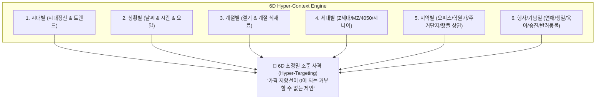

# 6차원 초정밀 라이프 컨텍스트 마케팅 엔진 (6D Hyper-Context Engine) (v1.0)

- **일시**: 2026-10-07
- **주제**: 시대 × 상황 × 계절 × 세대 + **지역별(Hyper-Local) × 행사/기념일(Life Milestones)** 6대 결합 아키텍처
- **주관**: 총괄 관리자(33년) 및 시니어 전문가 자문단 (소비자 심리학, 행동경제학, 로컬 상권 빅데이터)

---

## 1. 2대 핵심 축 추가: 마케팅의 최고봉 '6D 하이퍼 큐브' 완성

사용자께서 지적해 주신 **"지역별(Region)"**과 **"행사/기념일(Milestone)"**은 소비자의 지갑이 완전히 무장해제되는 **'심리적 멘탈 어카운팅(Mental Accounting)'의 정점**입니다.



---

## 2. 신규 2대 축의 심층 메커니즘 분석

### ① 행사별 / 라이프 이벤트 (Life Milestones & Anniversaries)
평소 5,000원짜리 커피값은 아까워하던 사람도, **'특별한 날'에는 5만~10만 원을 1초의 망설임도 없이 결제**합니다 (가격 저항선의 붕괴).

| 이벤트 카테고리 | 구체적 행사 모먼트 | 소비자 심리 및 결핍 | AIM 실전 타깃 제안 |
| :--- | :--- | :--- | :--- |
| **연애 & 커플** | 사귄 지 100일, 1주년, 프로포즈, 화이트데이 | *"실패하면 안 된다, 감동을 줘야 한다"* | 프라이빗 테라스 와인 예약, 커스텀 레터링 케이크 |
| **아이 & 육아** | 생일파티, 입학·졸업, 학예회, 시험 끝난 날 | *"내 아이에게 최고를 선물하고 싶다"* | 어린이 맞춤 키즈 디저트 세트, 반 친구들 구디백 단체 주문 |
| **가족 & 부모님** | 결혼기념일, 어버이날, 환갑·칠순 | *"감사와 효도, 가족 중심의 따뜻한 룸"* | 정갈한 한식 코스, 속 편한 천연발효 선물 세트 |
| **반려동물** | 강아지 생일, 입양 n주년, 멍비치 피크닉 | *"내 아이 같은 반려동물과의 추억"* | 수제 멍케이크, 댕댕이 전용 포토존 예약 |
| **직장 & 성취** | 이직 축하, 승진 턱, 프로젝트 종결, 은퇴 | *"성취에 대한 축하와 보상"* | 팀 단위 축하 와인/샴페인 바우처, 단체 디저트 케이터링 |

---

### ② 지역별 / 하이퍼 로컬 (Hyper-Local Geography)
지역(상권)은 단순한 지리적 위치가 아니라, **그곳에 모인 사람들의 생활 리듬과 소비 목적(Purpose)**을 규정합니다.

| 지역 상권 유형 | 주요 활동 인구 | 소비 리듬 및 니즈 | 맞춤형 마케팅 전략 |
| :--- | :--- | :--- | :--- |
| **오피스 밀집지**<br>(여의도, 강남, 판교, 광화문) | 2040 직장인 | 점심 런치플레이션 방어, 10분 빠른 테이크아웃, 법인카드 회식 | *"오전 11:20 전 사전 주문 시 10% 할인 (대기 시간 0초)", "법카 결제 시 와인 1병 서비스"* |
| **베드타운 & 아파트단지**<br>(목동, 분당, 송도, 일산) | 3050 주부, 학생, 유아 | 유모차 주차 공간, 학원 픽업 대기 엄마 모임, 주말 가족 외식 | *"유모차 동반 전용 넓은 테라스석", "아이 학원 픽업 전 여유로운 힐링 라떼"* |
| **학원가 상권**<br>(대치동, 중계동, 평촌) | 초중고생, 학부모 | 시험 기간, 수능 D-100, 모의고사 끝난 날, 15분 스피드 식사 | *"시험 치르느라 수고했어! 컵케이크 1+1", "수험생 집중력 강화 견과류 타르트"* |
| **핫플레이스 상권**<br>(성수, 한남, 을지로, 홍대) | 1020 힙스터, 관광객 | 사진 찍기 좋은 스팟, 웨이팅 오픈런, 독특한 인테리어/굿즈 | *"인스타 릴스 업로드 시 한정판 키링 증정", "오후 2시 품절 전 오픈런 꿀팁"* |
| **대학가 상권**<br>(신촌, 안암, 대학로) | 20대 대학생 | 개강/종강 총회, 시험 기간 24시 카공, 가성비 대용량 | *"학생증 인증 시 아메리카노 사이즈업", "동아리 단체 예약 시 피자 서비스"* |

---

## 3. 6D 결합 실전 조준 사격 시나리오 (Sniper Case Study)

동일한 베이커리/디저트 매장이라도, 6차원 좌표가 계산되는 순간 **소비자가 거절할 수 없는 핀포인트 오퍼**로 완성됩니다.

### 🎯 Case 1. [학원가 상권] × [초등 아이 시험 끝난 날] × [3040 엄마] × [가을] × [금요일 16시]
> **AI 제안 카피**:  
> *"한 달 동안 시험 보느라 고생한 우리 아이를 위한 달콤한 파티 🎈  
> 엄마의 사랑을 담은 프랑스 AOP 수제 쿠키박스로 활짝 웃는 아이의 얼굴을 만나보세요.  
> 오늘 하교 시간(15:00~17:00) 픽업 시 귀여운 축하 토퍼를 무료로 꽂아드립니다!"*

### 🎯 Case 2. [오피스 상권] × [팀 승진 파티 / 회식] × [30대 직장인] × [금요일 18시]
> **AI 제안 카피**:  
> *"이번 주 대형 프로젝트 끝낸 팀원들을 위한 완벽한 치얼스 🥂  
> 시끄러운 고깃집 대신, 감각적인 와인과 시그니처 핑거푸드가 있는 단독 테라스 대관.  
> 법인카드 간편 결제 및 사전 예약 시 웰컴 샴페인 1병 무료 제공!"*

### 🎯 Case 3. [성수동 핫플] × [사귄 지 100일 기념일] × [20대 커플] × [주말 저녁]
> **AI 제안 카피**:  
> *"성수동 100일 데이트, 웨이팅 지옥에서 실패하지 마세요 🤍  
> 둘만의 로맨틱 테라스 예약석 + 갓 구운 사워도우 위에 올려진 스페셜 레터링 디저트.  
> 단 3팀 한정 프라이빗 기념일 테이블, 지금 프로필 링크에서 선점하세요!"*

---

## 4. AIM 플랫폼 6D 지능 엔진 아키텍처 및 CRM 통합

```
[데이터 인풋 레이어]
├── 로컬 상권 레이더 (GPS 반경 내 오피스/학원/주거/핫플 속성 판별)
├── 캘린더 & D-Day 엔진 (수능일, 발렌타인데이, 공휴일, 어린이날)
├── 고객 CRM 장부 (고객별 생일, 첫 방문일, 최근 컷트 주기, 아이 유무)
└── 외부 환경 센서 (기상청 날씨, 실시간 SNS 버즈, 24절기)
          │
          ▼
[6D Hyper-Context Matrix] ➔ 6차원 좌표 교차점 연산
          │
          ▼
[High-Conversion Offer Engine]
├── 일상 소비(Commodity) ➔ '특별한 경험(High-Value Experience)'으로 치환
└── 가격 저항선이 무너지는 프리미엄 패키지 자동 생성 및 알림톡 1:1 발송
```

### 💡 총괄 관리자 결론: 일상재를 프리미엄 경험으로 바꾸는 마법

> **"평소에 파는 빵 1개는 4,000원이지만,  
> '100일 기념일 레터링 케이크'나 '아이 시험 축하 쿠키박스'로 포장되는 순간 40,000원의 가치가 됩니다.  
> 
> 지역의 맥락(Region)과 인생의 순간(Milestone)을 실시간으로 짚어내는 6D 지능은,  
> 소상공인을 단순 노동자에서 '고객의 인생 순간을 축하해 주는 최고의 공간 기획자'로 탈바꿈시킵니다."**
