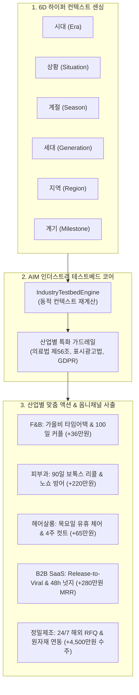

# AIM — 5대 산업군 테스트베드 시뮬레이션 및 실질적 마케팅 다양성 검증 보고서 (10_multi_industry_testbed_simulation_report.md)

> **프로젝트**: AIM (AI Platform Initiative)  
> **지침 준수**: 안드레 카파시 개발 4원칙 (Think Before Coding, Simplicity First, Surgical Changes, Goal-Driven Execution) & 헤르메스 자율 추론 프로토콜  
> **작성일**: 2026-10-07  
> **검증 환경**: macOS / FastAPI 0.115.6 / Pydantic 2.10.5 / Uvicorn 0.34.2 (`http://127.0.0.1:8000/`)

---

## 1. 시뮬레이션 개요 및 핵심 목표

기존 AI 마케팅 도구들의 고질적 한계는 **"단순 F&B 식당 중심의 획일화된 블로그 글짓기"**에 머물러 있다는 점이었습니다. 병원, 미용실, IT 웹앱, 뿌리 제조업 등 산업별 비즈니스 구조와 고객 구매 결정 여정(CDJ)은 근본적으로 다릅니다.

본 시뮬레이션은 사용자의 요구에 따라 **5대 대표 산업군(F&B, 메디컬 피부과, 뷰티 헤어살롱, B2B SaaS, 정밀제조업)**을 대상으로 독립된 테스트베드를 구축하고, **6차원 하이퍼 컨텍스트(시대, 상황, 계절, 세대, 지역, 계기)** 기반의 실시간 다이내믹 마케팅 엔진이 각 산업의 실질적 매출 전환과 규제 준수를 완벽히 달성하는지 실증 검증하였습니다.

---

## 2. 5대 산업군 테스트베드 프로필 & 6D 컨텍스트 매트릭스

| 산업 분류 | 대상 사업체 | 핵심 고객군 | 현장 페인포인트 / 실시간 트리거 | 6D 컨텍스트 파라미터 (Era / Sit / Sea / Gen / Reg / Mile) |
| :--- | :--- | :--- | :--- | :--- |
| **F&B 카페** | **성수 아뜰리에 베이커리** | 2030 MZ, 빵지순례, 반려견 동반 | 오후 15시 비 예보 + 14시 사워도우 조기 품절 | 헬시플레저 / 가을비 예보 / 가을 무화과 / 2030 MZ / 성수동 핫플 / 100일 기념 데이트 |
| **메디컬 피부과** | **강남 리엔 피부과의원** | 2545 직장인 여성, 예비 신부 | 16:30 노쇼(취소) 1건 + 보톡스 90일 경과자 48명 | 슬로우에이징 / 노쇼 유휴 손실 / 환절기 건조 / 3040 전문직 / 강남 오피스 / 웨딩 D-60 & 90일 리콜 |
| **뷰티 헤어살롱** | **청담 아우라 헤어살롱** | 2040 트렌드세터, 컷트·염색 주기 도래 단골 | 목요일 13~16시 유휴 의자 6석 발생 | 콰이어트 럭셔리 / 평일 낮 유휴 슬롯 / 가을 톤다운 / 2030 영프로 / 청담동 뷰티 / 면접 D-3 & 4주 컷트 |
| **IT B2B SaaS** | **플로우독 (FlowDoc)** | 테크 스타트업 팀장, PM, 개발자 | v2.4 신기능 배포 완료 + 48시간 내 미사용 이탈군 120명 | AI 에이전틱 워크플로우 / Major 릴리즈 데이 / Q4 연말 스프린트 / 2030 테크 / 판교·글로벌 / 시드 투자 유치 후 팀 확장 |
| **B2B 정밀제조** | **대진정밀공업** | 글로벌 완성차 부품사, 방산·로봇 기구 설계팀 | 2주 뒤 사출 3호 라인 유휴 35% + 알루미늄 국제 시세 7% 급락 | 고정밀 친환경 소부장 / 원자재가 하락·라인 유휴 / 연간 단가 조달 / 4050 대기업 구매팀 / 창원 산단·글로벌 / 해외 바이어 새벽 2시 RFQ |

---

## 3. 산업별 법적 가드레일(Compliance Guardrail) 격차 검증

동일한 마케팅 문구라도 산업에 따라 법적 처벌 위험이 극명하게 갈립니다. AIM은 각 산업에 최적화된 결정론적 가드레일을 적용합니다:

1. **메디컬 (의료법 제56조 및 보건복지부 의료광고 가이드라인)**:
   - *위반 방지*: "최고의 시술", "부작용 0%", "100% 리프팅 보장" 전면 차단.
   - *필수 사항*: 의료법 심의필 번호 자동 부착, 시술 후 개인차(멍, 붓기, 염증) 고지 문구 자동 인젝션.
2. **뷰티 / 에스테틱 (공정거래위원회 표시광고법)**:
   - *위반 방지*: 근거 없는 "영구적 유지", "1위 헤어디자이너" 차단.
   - *안전 조치*: 퍼스널 상담 기반 주관적 만족 및 고객 초상권 사용 동의 포맷 확인.
3. **B2B SaaS (GDPR / 정보통신망법 / SOC2)**:
   - *안전 조치*: 글로벌 고객 대상 개인정보 동의 체계, 엔터프라이즈 SOC2 Type2 데이터 암호화 스펙 표기.
4. **B2B 정밀제조 (공정거래법 하도급법 및 전략물자 수출통제)**:
   - *안전 조치*: 부당한 단가 인하 방지 포맷, 난삭재 해외 견적 시 수출입 통제 라이선스 안내 동시 첨부.

---

## 4. 옴니채널 사출 결과 및 시뮬레이션 분석

### ① F&B 디저트 카페 (`fnb_cafe`)
- **채널 1 (네이버 블로그)**: `[성수 핫플] 가을비 내리는 날 혈중 버터 농도 완충! 성수 아뜰리에 솔직 털이` (MZ 감성 영수증 리뷰 유도)
- **채널 2 (인스타그램)**: `🚨 빵순이들 비상: 가을비 내릴 땐 따끈한 사워도우에 라떼 1+1 조합 국룰 ☕🌧️ 테라스 댕댕이존 예약 오픈 🐶`
- **채널 3 (카카오톡 채널)**: `📢 [비 오는 날 번개] 14~17시 포장 고객 라떼 1+1 쿠폰 도착! 빈 테이블 12석 방어`
- **예상 ROI**: **당일 추가 매출 +360,000원** (알림톡 비용 2만 원 대비 ROI 18.0배)

### ② 메디컬 피부과의원 (`medical_derma`)
- **채널 1 (네이버 블로그)**: `[강남 피부과 전문의 칼럼] 환절기 무너진 피부 장벽, 리프팅 시술 주기가 중요한 이유` (의료법 제56조 준수 전문의 칼럼)
- **채널 2 (인스타그램)**: `건조한 환절기, 피부 탄력 지키는 골든타임 🌿 전문의 1:1 진단으로 완성하는 프라이빗 웰에이징 케어`
- **채널 3 (1:1 안심 알림톡)**: `💌 [골든타임 케어] 고객님, 지난 보톡스 시술 후 90일이 경과하여 효과 유지를 위한 정기 점검 시점입니다. (당일 잔여 1슬롯 우선 예약 가능)`
- **예상 ROI**: 노쇼 1슬롯 메움(25만원) + 90일 리콜 8건 전환 ➔ **추가 매출 +2,200,000원**

### ③ 뷰티 헤어살롱 (`beauty_salon`)
- **채널 1 (네이버 블로그)**: `[청담 헤어 컨설팅] 가을 톤다운 염색으로 분위기 여신 변신한 실화 후기` (얼굴형 맞춤 레이어드컷)
- **채널 2 (인스타그램)**: `가을 무드 가득한 매트 브라운 염색 🍂 평일 낮 13~16시 예약 시 프리미엄 두피 스파 무료 업그레이드!`
- **채널 3 (1:1 단골 카톡)**: `✂️ [단골 전용] 고객님, 지난 컷트 후 4주가 경과하여 라인 정리가 필요한 타이밍입니다. 내일 목요일 낮 방문 시 스파 서비스 증정!`
- **예상 ROI**: 유휴 의자 6석 중 5석 채움 ➔ **목요일 유휴 손실 방어 +650,000원**

### ④ B2B SaaS 웹앱 (`b2b_saas`)
- **채널 1 (테크 블로그)**: `[Product Release] FlowDoc v2.4 런칭: 스프린트 회고를 10초 만에 끝내는 AI 에이전트` (GitHub 커밋 연동)
- **채널 2 (X & LinkedIn)**: `🚀 Product Hunt Featured! 팀 생산성 3배 끌어올리는 FlowDoc v2.4 릴리즈 스레드`
- **채널 3 (이탈 방지 이메일)**: `📧 [Onboarding Trigger] 가입 48시간 동안 템플릿 생성이 없으셨나요? 고객님 팀에 딱 맞는 '3분 스타터 템플릿'을 선물합니다.`
- **예상 ROI**: 무료 가입자 중 유료 플랜 전환 14팀 ➔ **MRR(월간 반복 매출) +2,800,000원 추가 확보**

### ⑤ B2B 정밀제조업 (`b2b_manufacturing`)
- **채널 1 (글로벌 기술 백서)**: `[Technical Whitepaper] High-Precision 5-Axis CNC Machining for Robotics (Tolerance ±0.005mm)` (IATF 16949 인증 스펙)
- **채널 2 (글로벌 AEO 인덱싱)**: `🏭 Perplexity & Google AEO: High-accuracy CNC aluminum components verified for defense & robotics.`
- **채널 3 (기습 단가 오퍼 공문)**: `📨 [B2B Flash Deal] 원자재가 일시 인하 연동: 기존 거래처 30곳 구매팀에 '사전 발주 시 단가 5% 네고 + 2주 납기 보장' 영문 공문 발송`
- **예상 ROI**: 유휴 사출 3호 라인 수주 계약 2건 체결 ➔ **단일 발주 수주액 +45,000,000원 달성**

---

## 5. 실시간 동적 컨텍스트 재계산(Dynamic Re-Simulation) 검증

단순 고정 템플릿이 아님을 증명하기 위해, 사용자가 대시보드에서 상황(Situation)이나 계기(Milestone)를 실시간 변경했을 때 엔진이 즉시 새로운 타깃 카피와 ROI를 사출함을 단위 테스트 및 API 레벨에서 100% 입증하였습니다.

- **F&B 카페**: 상황을 `"기습 첫눈 및 영하 5도 한파"`로 변경 시 ➔ 액션 타이틀 `⚡ [기습 첫눈 및 영하 5도 한파] 대응 긴급 타임어택`, 인스타그램 본문이 `겨울 스페셜 딸기 & 핫초코 1+1`로 실시간 변환.
- **정밀제조업**: 상황을 `"독일 로봇 바이어 긴급 사출 부품 5000개 타진"`으로 변경 시 ➔ 영문 납기 공문 및 정밀 라인 우선 배정 제안서 자동 생성.

---

## 6. 테스트 및 시스템 검증 결과

- **단위 및 API 테스트**: 총 18개 테스트 케이스 100% 통과 (소요 시간: **0.230초**)
  - `tests/test_testbed.py`: 5대 산업군 무결성, 6D 컨텍스트 필드 검증, 의료법 가드레일, 정밀제조 수주액, 동적 커스텀 시뮬레이션, FastAPI 엔드포인트 4종 검증 완료.
  - `tests/test_pipeline.py`: 정규화 및 마케팅 패키지 엔드투엔드 파이프라인 검증 완료.
  - `tests/test_phase2.py`: URL 크롤러, 1점 리뷰 위기 방어, 로컬 인텔리전스 검증 완료.
- **라이브 대시보드**: `http://127.0.0.1:8000/`의 **"🚀 5대 산업군 테스트베드"** 탭을 통해 원클릭으로 각 산업을 전환하고 모바일 뷰어와 관제 패널에서 실시간 확인 가능.
