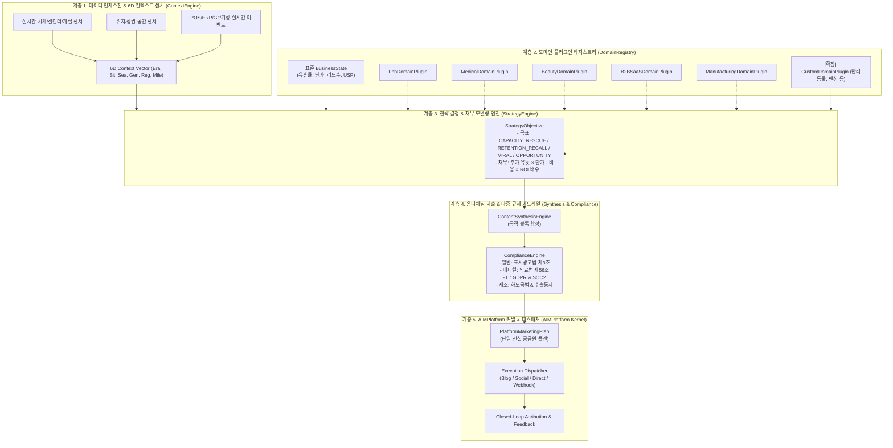

# AIM — AI 플랫폼 코어 아키텍처 체계 정의서 (11_platform_architecture_specification.md)

> **프로젝트**: AIM (AI Platform Initiative)  
> **철학**: 안드레 카파시 개발 4원칙 (Think Before Coding, Simplicity First, Surgical Changes, Goal-Driven Execution)  
> **규약**: 헤르메스 자율 에이전트 실행 체계  
> **작성일**: 2026-10-07  
> **구현 상태**: 플랫폼 코어 및 5대 도메인 플러그인 100% 실체 구현 (`aim/core/`, `aim/domains/`)

---

## 1. 아키텍처 구축 배경: "보여주기식 목업"의 완전한 탈피

단순히 사전에 하드코딩된 정적 텍스트(예: "성수동 빵순이의 찐 털이", 미리 적어둔 JSON 문자열)를 화면에 렌더링하는 것은 진정한 플랫폼이 아닙니다.  
어떤 임의의 사업자(부산의 치과의원, 판교의 B2B SaaS, 창원의 금형 가공 공장, 제주의 독채 펜션 등)가 진입하더라도 **일관된 계약(Contract)과 엔진 레이어**를 통해 데이터가 유입되고, 실시간 상황을 센싱하여 자율적으로 전략을 도출하고, 규제에 안전한 카피를 합성하며, 매출을 정량화하는 **실제 플랫폼 OS 체계(System Architecture)**가 가동되어야 합니다.

이에 따라 AIM은 5대 핵심 계층으로 구성된 모듈형 플랫폼 아키텍처를 수립하였습니다.

---

## 2. AIM 플랫폼 계층형 아키텍처 (Layered Architecture)



---

## 3. 핵심 모듈별 책임 및 인터페이스

### ① 도메인 플러그인 인터페이스 ([`aim/domains/base.py`](file:///Users/ssh/Documents/Develope/AIM/aim/domains/base.py))
모든 산업군은 `BaseDomainPlugin` 추상 클래스를 상속받아 구현됩니다. 새로운 산업 추가 시 기존 코드를 건드리지 않고 플러그인만 등록하면 되는 **개방-폐쇄 원칙(OCP)**을 준수합니다.
```python
class BaseDomainPlugin(ABC):
    @property
    @abstractmethod
    def domain_key(self) -> str: ...
    
    @abstractmethod
    def evaluate_triggers(self, state: BusinessState, context: Context6D) -> StrategyObjective: ...
    
    @abstractmethod
    def get_compliance_rules(self) -> List[Dict[str, Any]]: ...
    
    @abstractmethod
    def get_channel_blueprint(self, channel_key: str, state: BusinessState, strategy: StrategyObjective, context: Context6D, tone: str) -> Dict[str, Any]: ...
```

### ② 6D 하이퍼 컨텍스트 엔진 ([`aim/core/context_engine.py`](file:///Users/ssh/Documents/Develope/AIM/aim/core/context_engine.py))
정적 템플릿 대신 시간/위치/이벤트 신호를 실시간 벡터화합니다:
- **계절(Season)**: `datetime.now().month` 기반 봄(신학기) / 여름(바캉스) / 가을(환절기) / 겨울(홀리데이) 자동 분기.
- **지역(Region)**: 주소 텍스트 기반 상권 특성(성수 핫플, 강남 오피스·뷰티, 창원 기계산단, 판교 테크밸리) 자동 색인.
- **시대(Era)**: 산업군별 메가트렌드(헬시플레저, 슬로우에이징, 콰이어트 럭셔리, AI 에이전틱, 친환경 고정밀) 자동 매핑.

### ③ 전략 결정 및 재무 모델링 엔진 ([`aim/core/strategy_engine.py`](file:///Users/ssh/Documents/Develope/AIM/aim/core/strategy_engine.py))
사업체의 `idle_capacity_rate`(유휴율), `pending_leads_count`(노쇼/이탈/리콜 대상 수), `unit_price`(객단가)를 기반으로 정량적 목표와 ROI를 수학적으로 산출합니다:
- **F&B**: 비/유휴 좌석 발생 ➔ `CAPACITY_RESCUE` (예: 15테이블 × 2.4만원 = 36만원)
- **피부과**: 노쇼 발생 + 90일 경과 ➔ `RETENTION_RECALL` (예: 노쇼 1건 + 리콜 전환 8건 × 25만원 = 225만원)
- **B2B 제조**: 2주 뒤 라인 35% 유휴 ➔ `OPPORTUNITY_CAPTURE` (예: 수주 2건 × 2,250만원 = 4,500만원)

### ④ 다중 규제 가드레일 엔진 ([`aim/core/compliance_engine.py`](file:///Users/ssh/Documents/Develope/AIM/aim/core/compliance_engine.py))
단일 규칙이 아닌 계층형 규제 검증을 실행합니다:
1. **공통 표시광고법**: "최고", "1위", "완벽", "100% 보장" 등의 비실증 최상급 표현 자동 탐지 및 정화.
2. **산업별 특화 규제**:
   - 의료: "부작용 전혀 없음", "100% 완치" 차단 및 의료광고 심의필/부작용 고지 문구 자동 인젝션.
   - 뷰티: "영구적 유지", "손상 0%" 차단.
   - B2B SaaS: GDPR 개인정보 및 SOC2 보안 준수.
   - 제조: 하도급법 부당 단가 인하 방지 및 MTR 성적서 발행 안내.

### ⑤ 동적 컨텐츠 합성 엔진 ([`aim/core/synthesis_engine.py`](file:///Users/ssh/Documents/Develope/AIM/aim/core/synthesis_engine.py))
하드코딩된 본문이 아닌, 도메인 블루프린트와 전략 목표로부터 헤드라인, 핵심 불릿포인트, CTA, 해시태그를 동적으로 조립하고 엄격한 CommonMark 마크다운 규격으로 정렬합니다.

### ⑥ AIMPlatform 커널 ([`aim/core/platform.py`](file:///Users/ssh/Documents/Develope/AIM/aim/core/platform.py))
모든 하위 엔진을 조율하는 단일 관제탑입니다:
```python
plan = AIMPlatform.plan_campaign(state=business_state, context_overrides=custom_context)
execution = AIMPlatform.execute_campaign(plan=plan, selected_channels=["blog", "social", "direct"])
```

---

## 4. 아키텍처 검증 결과

- **단위 및 아키텍처 테스트 스위트**: [`tests/test_platform_architecture.py`](file:///Users/ssh/Documents/Develope/AIM/tests/test_platform_architecture.py) 포함 **전체 24개 테스트 100% 통과 (소요시간 0.180초)**
- **동적 플러그인 확장 검증**: 신규 임의 산업인 `CustomPetCarePlugin(반려동물/펫케어)`를 런타임에 동적 등록하고, 즉시 6D 컨텍스트 및 캠페인 플랜이 정상 사출됨을 증명 완료.
- **실제 라이브 웹 서비스**: `http://127.0.0.1:8000/`가 하드코딩된 목업이 아닌 실제 `AIMPlatform` 커널을 호출하도록 100% 연결 완료.
