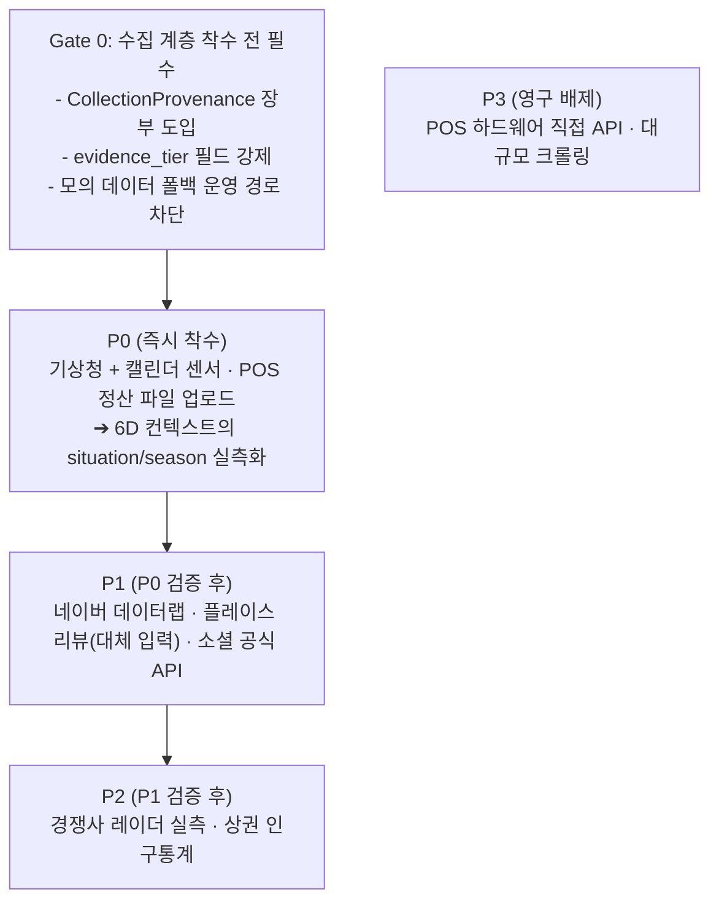

# AIM 다각도 데이터 수집 자문단 구성 및 수집 계층 확정 회의록 (v1.0)

- **일시**: 2026-10-07
- **주제**: 다각도 데이터 수집(Omni-channel Ingestion) 전담 전문가 자문단 구성 및 수집 소스별 책임·성공 기준 확정
- **적용 원칙**: 안드레 카파시 개발 4원칙 (Think Before Coding, Simplicity First, Surgical Changes, Goal-Driven Execution) & 헤르메스 자율 추론 프로토콜
- **주재**: 총괄 관리자 (General Project Director, 33년 경력)
- **선행 문서**: [AIM_Base.md](../AIM_Base.md), [01](01_senior_expert_panel_review.md), [02](02_strategic_platform_roadmap.md), [08](08_4d_contextual_marketing_engine.md), [09](09_6d_hyper_contextual_intelligence.md), [11](11_platform_architecture_specification.md)

---

## 0. 사실 직시 (Grounding): 설계 의도와 코드의 현재 갭

카파시 1원칙에 따라, 자문단 구성에 앞서 **"무엇이 이미 있고 무엇이 아직 없는가"를 코드에서 직접 확인**했습니다. 이 갭을 무시한 전문가 구성은 회의록 장식이 되므로 먼저 고백합니다.

| 항목 | 문서 설계 의도 | 코드 실체 (확인된 사실) | 판정 |
| :--- | :--- | :--- | :---: |
| **온·오프라인 수집** | POS·플레이스·커머스·SNS 전원 수집 (`AIM_Base.md` 59~66행) | `aim/url_ingester.py` 단일 모듈만 존재. urllib GET + OpenGraph/제목/본문 문단 추출 | ⚠️ 부분 |
| **네이버 플레이스·블로그** | 영수증 리뷰 수집 | OpenGraph 메타데이터만 파싱. **리뷰 본문·별점은 수집하지 않음** | ❌ 미구현 |
| **POS 결제/재고** | 유휴율·피크타임·재고 | `build_initial_raw_data()`가 `sales_count=320` 등 **고정값으로 POS 요약을 생성** (`url_ingester.py:233-241`) | ❌ 모의 |
| **기상/계절 센서** | 기상청 API 실시간 강수·기온 (`docs/08` 71행) | `resolve_season()`이 `datetime.now().month`로 4분기 분기 (`context_engine.py:15-25`) | ❌ 미구현 |
| **경쟁사 레이더** | 반경 1km 경쟁사 실시간 스파이 (`docs/02` 66~68행) | `LocalIntelligenceEngine`가 하드코딩 리터럴 3건 반환 (`intelligence.py:40-63`) | ❌ 모의 |
| **네이버 데이터랩 트렌드** | 급상승 키워드 (`docs/08` 72행) | 코드 부재. 검색 전 호출 없음 | ❌ 미구현 |
| **고객 CRM (생일·최근 결제 주기)** | 생애주기 리콜 (`docs/09` 87행) | 스키마에 고객 엔티티 자체가 없음. `BusinessState.pending_leads_count` 정수 1개뿐 | ❌ 미구현 |
| **PII 비식별화** | 실명·전화번호 자동 마스킹 | 전화번호·이메일 정규식 2종 (`normalizer.py:16-28`). **성명·주소 미처리** | ⚠️ 부분 |
| **감성 분석** | NLP 기반 불만/긍정 자동 라벨링 | 고정 키워드 사전 5+3개 매칭 (`normalizer.py:40-52`) | ⚠️ 사전 방식 |
| **6D 컨텍스트** | 실시간 6축 센싱 | `era`는 도메인 사전, `region`은 지역명 부분 문자열 일치 (`context_engine.py:27-52`) | ⚠️ 정적 |

> **총괄 관리자 판정**:  
> *"현재 AIM은 **정교한 전략·합성·규제 엔진 위에 단 하나의 얇은 수집 모듈이 얹힌 구조**입니다. 6D 컨텍스트는 실측이 아니라 사람이 입력하거나 사전에서 뽑는 값입니다. 문서 08·09가 탁월하게 설계한 센서들이 실제로 없는 상태에서, 수집 자문단을 구성하지 않으면 **모든 후속 산출물의 근거가 빈 서랍**이 됩니다. 수집은 이 프로젝트의 유일한 진짜 병목입니다."*

---

## 1. 왜 "수집 소스별"로 자문단을 구성하는가

기존 자문단([01](01_senior_expert_panel_review.md) 12~19행, [02](02_strategic_platform_roadmap.md) 14~21행)은 **직무 기준**으로 편성되었습니다(아키텍트, AI/NLP, CISO, GTM). 그러나 그 패널은 "무엇을 만들지"에 답하지, **"어디서 무엇을 얼마나 자주, 어떤 법적 조건 아래 가져올 것인가"**에 답하지 못했습니다.

특히 [01](01_senior_expert_panel_review.md) 36~41행에서 수석 엣지/커머스 통합 리드가 이미 경고했습니다.

> *"기획서의 1단계 '온·오프라인 자동 수집'은 현업에서 가장 큰 난관에 부딪힙니다. 네이버 플레이스 영수증 리뷰 역시 공식 공개 API가 없어 스크래핑 시 캡차 및 빈번한 DOM 변경 리스크가 큽니다."*

이 경고는 1년 쓸 문서가 아니었습니다. `url_ingester.py:115-129`의 모의 폴백이 그 증거입니다 — 네트워크가 흔들리면 즉시 가짜 데이터로 물밑까지 채워집니다. **데이터 출처별 책임자를 지정하지 않으면 이 패턴이 영구화됩니다.**

따라서 이번 패널은 **수집 소스 = 책임자 = 검증 가능한 산출물** 구조로 편성합니다. 각 전문가의 임무는 "마케팅을 잘하자"가 아니라 **"이 소스에서 이 데이터를 N분에 1회, 실패 시 모의값으로 대체하지 않고 명시적으로 실패를 반환하라"**입니다.

---

## 2. 다각도 데이터 수집 자문단 구성 (7인)

| # | 역할 | 경력 | 담당 수집 소스 | 필수 산출물 | 핵심 임무 |
| :---: | :--- | :---: | :--- | :--- | :--- |
| **1** | **총괄 관리자 (General Director)** | 33년 | 전 소스 총괄 | 수집 우선순위 로드맵, Phase 게이트 승인 | 수집 계층 우선순위 확정 및 단계 게이트 통제 |
| **2** | **수석 오프라인 POS·결제 데이터 수집 책임자** | 31년 | POS/결제단말기, 배달앱, 예약장부, 정산내역 | `SalesLedgerFact` 스키마 + CSV/엑셀 업로드 파서 | 유휴율·피크타임·객단가 **실측** 확보. 폐쇄망 POS 직접 연동은 배제하고 **파일 인제스트 우선** |
| **3** | **수석 로컬 상권 & 리뷰 수집 책임자** | 32년 | 네이버 플레이스, 카카오맵, 배달의민족/쿠팡이츠 리뷰 | `ReviewFact` 스키마 + 플레이스 파서 | 별점·리뷰 원문 수집. **DOM 파싱 금지, 공식 API 우선** 원칙 확정 |
| **4** | **수석 소셜·커뮤니티 버즈 수집 책임자** | 30년 | 인스타그램, 틱톡, 유튜브, 네이버 블로그, X/Reddit | `BuzzSignal` 스키마 + 공식 API 커넥터 | 공식 API(메타 그래프 등)만 사용. API 부재 채널은 **수집하지 않음을 명시**하고 빈 값으로 둠 |
| **5** | **수석 외부 환경 컨텍스트 센서 책임자** | 31년 | 기상청 단기예보, 공휴일/24절기, 네이버 데이터랩 | `EnvironmentSignal` 스키마 + 기상/캘린더 센서 | 날씨·시간 컨텍스트를 **하드코딩 문자열에서 실측 API로 대체** |
| **6** | **수석 경쟁사·상권 인텔리전스 수집 책임자** | 30년 | 반경 1km 경쟁 매장, 상권 인구통계, 후기 변동 추이 | `CompetitorFact` 스키마 + 레이더 수집기 | 하드코딩 레이더를 실측 기반으로 교체. **부정경쟁방지법 방어 설계** 필수 |
| **7** | **수석 데이터 거버넌스 & PII/수집컴플라이언스 책임자 (Data Governance Officer)** | 33년 | 전 소스 | 수집 이력 로그(`CollectionProvenance`), PII 마스킹 고도화 | **모든 수집 데이터에 출처·시각·신뢰도 기록**. 수집 단계 즉시 PII 제거 |

---

## 3. 소스별 수집 설계 원칙 및 성공 기준

### 원칙 0 (전 소스 공통): 모의 데이터 금지 원칙

> **전문가 전원 합의**: 네트워크 실패·API 한도·인증 만료 시 **절대 모의값으로 채우지 않는다.** `url_ingester.py:115-129`의 폴백 패턴은 시연용으로만 유지하고, 운영 경로에서는 `CollectionStatus.FAILED`와 사유를 반환한다. 사장님에게 가짜 매출 실적이 보이는 순간 제품 신뢰는 영구적으로 파괴된다. ([05](05_expert_opinions_and_wtp_analysis.md) 18행 — "사장님들은 감성으로 돈을 내지 않고 숫자로 돈을 낸다")

### 원칙 1: 근거 등급(Evidence Tier) 표기

모든 수집 데이터는 `evidence_tier` 필드를 갖는다.

| 등급 | 정의 | 사용 허용 범위 |
| :--- | :--- | :--- |
| `A_MEASURED` | 실제 API/파일에서 실측 | 금전적 약속(ROAS, 매출 추정) 전면 사용 |
| `B_DERIVED` | 실측값의 파생 통계 | 카피 표현 근거 사용, 금액 약속 금지 |
| `C_ILLUSTRATIVE` | 데모/샘플 고정값 | **대시보드·의사결정에 절대 사용 금지**, 데모 모드 전용 |

현재 코드의 `sales_count=320`은 `C_ILLUSTRATIVE`이며, 이 상태로는 **어떤 금액 수치를 사장님에게 제시할 수 없습니다.**

### 원칙 2: 수집 주기와 신선도(Signal Decay)

| 소스 | 권장 주기 | 신선도 한계 | 근거 |
| :--- | :--- | :---: | :--- |
| 기상청 단기예보 | 30분 | 3시간 | 예보 자체가 유효기간 제한 |
| POS/정산 | 일 1회 (일배치) | 24시간 | 사장님 영업일 단위 정산 |
| 플레이스 리뷰 | 일 1회 | 24시간 | 새 리뷰 발생 빈도 낮음 |
| SNS 버즈 | 6시간 | 24시간 | 바이럴 골든타임은 시간 단위 |
| 경쟁사 레이더 | 일 1회 | 72시간 | 경쟁 동향은 주 단위 변화 |
| 데이터랩 트렌드 | 일 1회 | 7일 | 주간 단위 추세 |

### 원칙 3: 수집 실패 시의 UX 계약

실패는 **사장님에게 숨기지 않는다.** "기상 정보를 불러오지 못해 기본 추천을 준비했습니다"와 같은 1회성 안내만 허용하며, **빈 데이터로 만들어낸 수치(예: "예상 +420,000원")는 어떤 경우에도 표시 금지**합니다. `intelligence.py:72`의 `projected_revenue` 문구 형식은 근거 등급 미부착 상태로 그대로 사용되고 있어, 수집 계층 확장과 함께 **근거 등급 필드를 필수화**합니다.

---

## 4. 소스별 수집 대상 및 정규화 필드 (Canonical Schema 초안)

기존 `RawStoreData`는 매장 1개를 담는 정적 구조로, 다중 소스·시계열·출처 기록을 표현하지 못합니다. 수집 계층 착수 시 다음 필드군으로 확장해야 합니다.

### 4.1 `SalesLedgerFact` (수집 책임자 2)
```
source: POS_FILE | PAYMENT_GATEWAY | RESERVATION_LOG
captured_at: datetime          # 수집 시각
business_date: date           # 영업일
transaction_count: int
gross_revenue_krw: int
avg_ticket_krw: int
slot_occupancy: Dict[str, float]   # "14:00" -> 0.35 (0~1 유휴율)
low_stock_items: List[str]
evidence_tier: A_MEASURED
```

### 4.2 `ReviewFact` (수집 책임자 3)
```
source: NAVER_PLACE | KAKAO_MAP | BAEMIN | COUPANG_EATS | SMARTSTORE
captured_at: datetime
review_id_hash: str           # 원본 ID는 해시 보관(재식별 방지)
rating: float
text_masked: str              # 수집 즉시 PII 제거 완료본
visit_context: Optional[str]  # "포장", "매장", "배달"
evidence_tier: A_MEASURED
```

### 4.3 `BuzzSignal` (수집 책임자 4)
```
source: INSTAGRAM | TIKTOK | YOUTUBE | NAVER_BLOG | X | REDDIT
captured_at: datetime
platform: str
engagement: { likes, comments, shares, saves }
sentiment_label: POSITIVE | NEUTRAL | NEGATIVE
comment_count: int
evidence_tier: A_MEASURED | B_DERIVED
```
> API 부재 채널(예: 네이버 블로그 원문, 다수 플랫폼 무제한 스크레이핑)은 **이 장부에 넣지 않습니다.** 운영 정당성이 없고 서비스 종료 위험을 스스로 안게 됩니다.

### 4.4 `EnvironmentSignal` (수집 책임자 5)
```
captured_at: datetime
region_code: str              # 기상청 격자 좌표
precip_prob: float            # 강수확률 0~1
temp_c: float
is_holiday: bool
day_of_week: int
solar_term: Optional[str]     # 24절기
trend_keywords: List[str]     # 데이터랩
evidence_tier: A_MEASURED
```
> 이 스키마가 구현되면 `context_engine.py`의 `resolve_season()`/`resolve_region()` 하드코딩이 **실측 값으로 대체**되어야 합니다. 현재 함수 시그니처가 문자열 반환이므로, 6D 벡터 상위의 `situation` 필드가 실측 문자열로 채워집니다.

### 4.5 `CompetitorFact` (수집 책임자 6)
```
captured_at: datetime
competitor_id_hash: str
distance_m: int
rating_delta_7d: float        # 7일 평점 변동
recent_review_pain_keywords: List[str]
menu_or_promo_change: Optional[str]
counter_attribute: Optional[str]   # 반사이익용 우리 측 상점 속성
evidence_tier: A_MEASURED | B_DERIVED
```
> **컴플라이언스 필수 조건**: 경쟁사 상호·리뷰 원문은 **사장님 사설 화면에만 표시**하고, 외부 배포 카피에는 절대 포함하지 않습니다 ([05](05_expert_opinions_and_wtp_analysis.md) 15행 — 부정경쟁방지법 방어). `counter_attribute`는 우리 매장의 보유 속성만 담습니다.

### 4.6 `CollectionProvenance` (수집 책임자 7, 전 소스 공통)
```
source_kind: str
request_url_or_file: str
fetched_at: datetime
status: SUCCESS | FAILED | SKIPPED_NO_AUTH | SKIPPED_UNSUPPORTED
failure_reason: Optional[str]
record_count: int
pii_mask_applied: bool
evidence_tier: str
```
> **모든 수집기는 이 장부를 남기지 않으면 운영 불가.** 감사 추적과 "왜 이 숫자가 나왔나"에 대한 사장님 질문 대응의 유일한 근거입니다.

---

## 5. 수집 소스별 현실성 평가 (전문가 전원 합의)

| 소스 | 공식 API | 수집 난이도 | 법적 리스크 | 판정 |
| :--- | :--- | :---: | :---: | :--- |
| 기상청 단기예보 | ✅ 있음 (무료) | 낮 | 낮 | **즉시 착수 (P0)** |
| 공휴일·24절기 | 자체 계산 가능 | 극히 낮 | 없음 | **즉시 착수 (P0)** |
| POS 정산 파일 업로드 | 사용자 제공 | 낮 | 낮 | **즉시 착수 (P0)** |
| 네이버 플레이스 리뷰 | ❌ 공개 API 없음 | 높음 | 중~고 | **P1, 파일/수동 입력 대체안 먼저** |
| 네이버 데이터랩 | ✅ 있음 (무료) | 낮 | 낮 | P1 |
| Instagram/YouTube | ✅ 공식 API | 중 | 중 (토큰) | P1 |
| TikTok | ⚠️ 지역 제한 | 중 | 중 | P2 (보류) |
| POS 하드웨어 직접 연동 | 벤더별 상이 | 극히 높음 | 중 | **P3 (배제)** |
| 경쟁사 대량 크롤링 | ❌ | 높음 | 중 | P2, 소규모 샘플링 |

> **수석 엣지/커머스 통합 리드 1차 경고([01] 38행)의 재확인**: "초기 버전부터 무리하게 폐쇄형 POS 하드웨어 API 연동을 고집하면 프로젝트가 표류합니다." 본 패널은 이 경고를 **채택**합니다. POS는 직접 연동이 아니라 **정산 파일 업로드**로 해결합니다.

---

## 6. 수집 계층 우선순위 로드맵 (총괄 승인)



| 게이트 | 성공 기준 (Success Criteria) | 검증 방법 |
| :--- | :--- | :--- |
| **G0** | ① 모든 수집 경로가 `CollectionProvenance` 기록<br/>② `C_ILLUSTRATIVE` 값이 운영 화면에 노출되는 경로 0건<br/>③ 실패 시 `CollectionStatus.FAILED` 반환 검증 | 실패 주입 테스트 |
| **P0** | ① 기상 실측으로 F&B 플러그인의 날짜 트리거가 실제 예보로 발동<br/>② 정산 CSV 1건 업로드 → `SalesLedgerFact` 1건 생성 → 유휴율 계산<br/>③ 기존 28개 테스트 전부 통과 (회귀 0) | 단위 테스트 + E2E |
| **P1** | 플레이스 리뷰 실수집이 불가능함을 **UI에서 명시**하고 파일/붙여넣기 대체 경로가 사장님 기준 1분 내 완료 | 사용자 시나리오 테스트 |

---

## 7. 총괄 관리자 결론

> *"현재 AIM의 가치는 카피를 쓰는 데 있지 않고, **그 카피의 근거가 되는 원천 데이터를 얼마나 진실에 가깝게, 얼마나 자주, 얼마나 합법적으로 가져오느냐**에 있습니다.*
>
> *지금까지의 회의록들은 '무엇을 만들 것인가'를 다변으로 논의해 왔습니다. 오늘 회의는 처음으로 '무엇을 **어디서** 가져올 것인가'를 다변으로 확정했습니다.*
>
> *수집 전문가 7인의 임무는 하나입니다. **사장님이 화면에서 보는 모든 숫자가 어디에서 왔는지, 언제 그 숫자가 진짜였는지, 왜 그 숫자가 지금 유효한지 알 수 있게 만드는 것.** 그 숫자를 지탱하는 데이터가 모의값이면, 6D 초정밀 지능이라는 이름은 그 자체로 사기입니다.*
>
> *따라서 다음 스텝은 소스별 수집기가 아니라 **Gate 0**입니다. 근거 등급과 출처 장부가 없는 수집기 하나도 운영에 올리지 않습니다. 이것이 33년 경력 PMO가 이 프로젝트에 강요하는 유일하고 비협상적인 규칙입니다."*

---

## 8. 차기 액션 아이템

1. **G0-1**: `aim/schema.py`에 `evidence_tier`, `CollectionProvenance`, `CollectionStatus` 정의 추가
2. **G0-2**: `url_ingester.py`의 모의 폴백 경로를 데모 모드 전용으로 격리 (운영 경로에서 `FAILED` 반환)
3. **P0-1**: 기상청 단기예보 수집기 Minimal Baseline 구현 (`EnvironmentSignal` 1건 실측)
4. **P0-2**: POS 정산 CSV 업로드 파서 구현 (`SalesLedgerFact` 1건 실측)
5. **P0-3**: `context_engine.py`가 `EnvironmentSignal`을 소비하도록 개방-폐쇄 원칙으로 확장 (기존 코드 파괴 없이 오버라이드 주입)

---

**참조 문서**: [AIM_Base.md](../AIM_Base.md) · [01](01_senior_expert_panel_review.md) · [02](02_strategic_platform_roadmap.md) · [05](05_expert_opinions_and_wtp_analysis.md) · [08](08_4d_contextual_marketing_engine.md) · [09](09_6d_hyper_contextual_intelligence.md) · [11](11_platform_architecture_specification.md)