# AIM — 3대 유기적 통합 플랫폼 솔루션 아키텍처 정의서 (12_tripartite_organic_platform_architecture.md)

> **프로젝트**: AIM (AI Platform Initiative)  
> **핵심 정의**: *"서비스 되어야 하는 솔루션, 유료 가입자가 볼 수 있는 대시보드 솔루션, 플랫폼 총괄 관리 솔루션이 유기적으로 돌아가는 완전체 플랫폼"*  
> **지침 준수**: 안드레 카파시 개발 4원칙 (Think Before Coding, Simplicity First, Surgical Changes, Goal-Driven Execution)  
> **작성일**: 2026-10-07  
> **상태**: 구현 및 검증 완료 (`aim/web_app.py`, `aim/tenant/`, `aim/admin/`, `aim/core/`)

---

## 1. 플랫폼의 본질적 구조: 3대 유기적 축 (Tri-Partite Architecture)

단순한 화면 하나나 개별 스크립트는 플랫폼이 될 수 없습니다.  
진정한 B2B AI 마케팅 플랫폼은 아래 **3대 솔루션이 단일 생태계 안에서 유기적으로 데이터를 주고받으며 가치를 창출**해야 합니다.

```mermaid
flowchart LR
    subgraph S1 ["1. 플랫폼 총괄 관리 솔루션<br/>(Master Admin Console)"]
        A_KPI["전사 MRR & 가입자 플릿 관리"]
        A_AUDIT["전사 규제 인터셉트 감사 로그"]
        A_HEALTH["에이전트 인프라 건전성 모니터링"]
    end

    subgraph S2 ["2. 유료 가입자 사업자 솔루션<br/>(Subscriber Tenant Portal)"]
        T_BILL["멤버십 플랜 (PRO/ENT) & 구독 관리"]
        T_ROI["구독료 대비 창출 매출 (Value Attribution)"]
        T_TRIG["매장 실시간 현안 & 원클릭 타임어택"]
    end

    subgraph S3 ["3. 서비스 실행 솔루션<br/>(AIM Service Engine)"]
        E_6D["6D 하이퍼 컨텍스트 센서"]
        E_PLUG["5대 산업군 도메인 플러그인"]
        E_COMP["다중 규제 가드레일 (의료법/표시광고/GDPR)"]
        E_DISP["옴니채널 사출 (Blog / Insta / Kakao / RFQ)"]
    end

    S1 <--"플랜 변경 / 테넌트 상태 제어"--> S2
    S2 <--"캠페인 실행 요청"--> S3
    S3 <--"매출 귀속 & ROI 피드백"--> S2
    S2 <--"누적 가치 & MRR 집계"--> S1
    S3 <--"규제 차단 내역 실시간 전송"--> S1
```

---

## 2. 3대 솔루션 세부 명세 및 기능 체계

### 솔루션 1: 👑 플랫폼 총괄 관리 솔루션 (Master Admin Console)
- **대상**: 플랫폼 오퍼레이터, 최고경영진, 시스템 관리자
- **핵심 역할**:
  1. **전사 비즈니스 KPI 집계**:
     - 가입 활성 사업자 수: 5개사 (가동률 100%)
     - 월간 반복 매출 (MRR): 545,000원
     - 플랫폼 누적 창출 매출: +145,320,000원
     - 가입자 평균 투자수익률 (ROI): **19.4배**
  2. **가입 테넌트 플릿 통합 관리 (Fleet Management)**:
     - 테넌트 목록 (사업체명, 대표자, 산업 도메인, 플랜, 상태, 누적 창출액) 조회
     - 런타임 제어: 테넌트 상태 토글 (`ACTIVE` ⇄ `PAUSED`), 구독 플랜 전환 (`PRO` 49k ⇄ `ENTERPRISE` 199k)
  3. **전사 규제 컴플라이언스 실시간 인터셉트 로그 (Audit Stream)**:
     - 전 테넌트에서 발생한 의료법 제56조 위반("부작용 전혀 없음"), 공정위 표시광고법 위반("국내 1위"), 하도급법 위반 문구를 실시간 차단하고 정화한 감사 기록 열람.
  4. **AI 에이전트 & 인프라 건전성 모니터링**:
     - 6D 컨텍스트 엔진 (3ms), 전략 엔진 (6ms), 규제 가드레일 (100% 차단), 사출 엔진 건전성 99.98% 가동 확인.

---

### 솔루션 2: 💼 유료 가입자 사업자 솔루션 (Subscriber Tenant Portal)
- **대상**: 구독료를 지불하는 소상공인, 병원장, 원장, 스타트업 대표, 공장장
- **핵심 역할**:
  1. **구독 멤버십 & 결제 상태 투명성**:
     - 현재 이용 플랜 (`⭐ PRO 플랜 49,000원/월` 또는 `💎 ENTERPRISE 플랜 199,000원/월`)
     - 구독 상태 (`● 정상 구독 중`) 및 익월 자동 결제 안내
  2. **실질적 가치 귀속 카운터 (Value Attribution & ROI)**:
     - *"단순 매장 조회가 아니라, 내가 낸 구독료 대비 AIM이 이번 달에 얼마를 벌어다 주었는가?"*
     - 예: **지불 구독료 49,000원 대비 창출 매출 +4,320,000원 (ROI 88.2배 달성)**
     - 총 자동 집행 캠페인 수 (12회) 실시간 누적.
  3. **매장 실시간 현안 (Live Trigger) 감지**:
     - 예: 오늘 15시 비 예보 + 2시 조기 품절 / 16:30 의사 노쇼 1건 + 90일 보톡스 리콜 48명 / 목요일 유휴 의자 6석.
  4. **원클릭 타임어택 승인 및 즉시 집행**:
     - 추천 캠페인을 버튼 한 번으로 승인하면 카카오 알림톡/인스타/블로그로 즉시 송출되고 창출 매출이 내 계정에 즉시 귀속.

---

### 솔루션 3: ⚡ 서비스 실행 솔루션 (AIM Service Engine)
- **대상**: 플랫폼의 백그라운드 자율 에이전트 및 마케팅 디스패처
- **핵심 역할**:
  1. **6차원 하이퍼 컨텍스트 실시간 연산 (`ContextEngine`)**:
     - 시대, 상황, 계절, 세대, 지역, 계기를 표준 벡터로 정규화.
  2. **5대 산업군 도메인 플러그인 (`DomainRegistry`)**:
     - F&B, 메디컬 피부과, 뷰티 살롱, B2B SaaS, 정밀제조업 로직 가동.
  3. **다중 규제 가드레일 (`ComplianceEngine`)**:
     - 의료법 제56조 심의필/부작용 고지 자동 인젝션, 표시광고법 과장 차단.
  4. **옴니채널 동적 사출 & 모바일 뷰어**:
     - 채널별 최적화된 카피 생성 및 모바일 기기 프레임 실시간 렌더링.

---

## 3. 유기적 연동 시나리오 검증 (Organic Cohesion Verification)

본 플랫폼의 3대 솔루션은 완전히 실시간으로 동기화됩니다:

1. **캠페인 집행 ➔ 가입자 ROI 증가 ➔ 마스터 어드민 전사 KPI 반영**:
   - 가입자 포털에서 청담 헤어살롱(`TENANT_003`)이 "원클릭 즉시 집행"을 누름.
   - 서비스 엔진이 카톡 단골 넛지와 인스타그램 피드를 사출하고 예상 매출 +650,000원을 계산.
   - 가입자 포털의 누적 창출 매출이 즉각 `+7,800,000원` ➔ `+8,450,000원`으로 갱신.
   - 총괄 관리자의 플랫폼 누적 가치(`kpiValue`) 역시 즉각 `+650,000원` 증가하여 실시간 동기화.
2. **마스터 어드민 플랜 변경 ➔ 가입자 대시보드 멤버십 즉시 갱신**:
   - 총괄 관리자 콘솔에서 성수 베이커리(`TENANT_001`)의 플랜을 `PRO(49k)`에서 `ENTERPRISE(199k)`로 업그레이드.
   - 가입자 대시보드에 접속 시 멤버십 배지가 즉각 `💎 ENTERPRISE 플랜 (199,000원/월)`으로 바뀌며, 플랫폼 총 MRR도 `545,000원` ➔ `695,000원`으로 즉시 재계산.

---

## 4. 검증 결과 및 라이브 확인 방법

- **단위 및 통합 검증 테스트**: [`tests/test_organic_platform_solutions.py`](file:///Users/ssh/Documents/Develope/AIM/tests/test_organic_platform_solutions.py) 포함 **전체 28개 테스트 100% 통과 (0.414초)**.
- **실제 라이브 웹 서비스 (`http://127.0.0.1:8000/`)**:
  - 최상단 솔루션 네비게이터를 통해:
    - 💼 **[1. 유료 가입자 사업자 솔루션]**: 5개사 사업체 전환, 구독 플랜, ROI 카운터, 원클릭 집행.
    - 👑 **[2. 플랫폼 총괄 관리 솔루션]**: 전사 MRR, 테넌트 플릿 제어, 규제 감사 로그, 에이전트 헬스.
    - ⚡ **[3. 서비스 실행 솔루션]**: 3대 채널 사출, 5대 산업 테스트베드, 기습 부스터, 스파이 레이더.
  - 3개 솔루션이 완벽하게 유기적으로 구동되는 플랫폼 완전체를 직접 조작하고 확인하실 수 있습니다.
