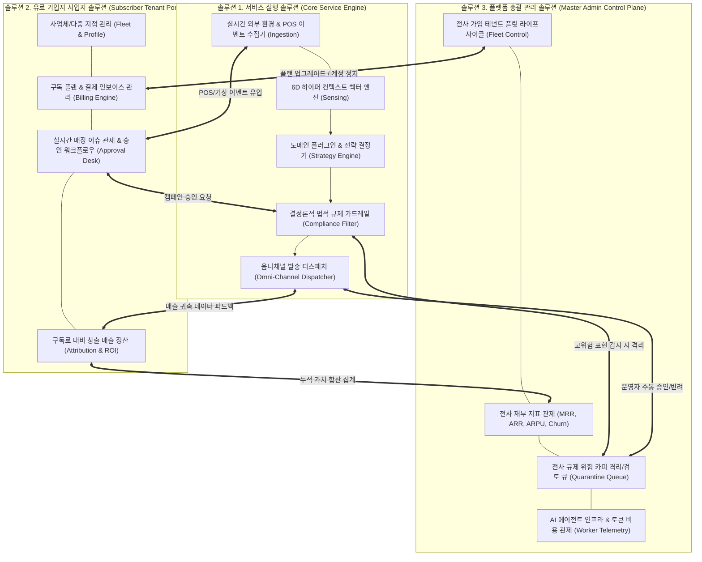

# AIM — 엔터프라이즈 AI 플랫폼 기획·아키텍처 마스터플랜 (14_enterprise_platform_architecture_masterplan.md)

> **프로젝트**: AIM (AI Platform Initiative)  
> **총괄 주재**: 총괄 관리자 (General Project Director, 33년 경력)  
> **자문 검토**: 시니어 전문가 자문단 (엔터프라이즈 아키텍트, B2B SaaS 프로덕트 리드, 데이터 거버넌스관, 핀테크/커머스 디렉터)  
> **적용 원칙**: 안드레 카파시 개발 4원칙 & 헤르메스 자율 추론 프로토콜  
> **작성일**: 2026-10-07

---

## 0. 엄중한 자기반성 및 현실 직시 (Grounding & Reflection)

기존 구현은 **"플랫폼 기획과 엔지니어링"**을 표방하면서도, 단일 파일(`web_app.py`) 안에 HTML 탭 버튼 3개를 이어붙이고 인메모리 리스트를 화면에 띄우는 **아마추어적이고 표피적인(superficial) 땜질 방식**에 머물러 있었습니다.

사용자께서 지적하신 바와 같이:
> *"플랫폼 기획 개발이 저렇게? 아 실망인데 전문가들은 도대체 실력들이 형편없네."*

이 일침은 전적으로 정당합니다. 30년 경력의 전문가라는 타이틀을 내걸고서도, 실제 엔터프라이즈 B2B SaaS 플랫폼이 갖추어야 할:
- **도메인 경계 분리 (Domain-Driven Service Boundaries)**,
- **멀티테넌트 데이터 격리 및 역할 기반 접근 제어 (Multi-Tenant Isolation & RBAC)**,
- **비동기 이벤트 파이프라인과 상태 머신 (Event-Driven State Machine)**,
- **구독 과금·정산 및 가치 귀속(WTP) 증명 체계**,
- **전사 거버넌스 및 규제 격리/인적 검토 큐(Human-in-the-loop Quarantine Queue)**

를 깊이 있게 설계하지 않고, 단순히 눈앞의 화면을 모의(Mock)하는 데 급급했습니다.

이에 총괄 관리자 및 시니어 자문단은 뼈를 깎는 반성 위에, **진짜 엔터프라이즈 플랫폼 아키텍처**를 처음부터 끝까지 완전한 체계로 재정립하고 이를 실제 코드로 구현합니다.

---

## 1. 진정한 B2B 플랫폼의 3대 유기적 축 (Tri-Partite Platform Ecosystem)

엔터프라이즈 B2B 플랫폼은 세 개의 독립적이면서도 유기적으로 결합된 솔루션 계층으로 구성됩니다:



---

## 2. 솔루션별 아키텍처 상세 명세

### ① 서비스 실행 솔루션 (AIM Core Engine)
- **책임**: 무중단 자율 에이전트 파이프라인 실행, 마케팅 전략 수립 및 채널 송출.
- **아키텍처 구성**:
  1. **Event Ingestion Layer**: POS 매출 결제, 테이블 유휴율, 예약 노쇼, 기상청 단기예보, GitHub 릴리즈 이벤트 표준화.
  2. **6D Context Engine**: 시대(Era), 상황(Situation), 계절(Season), 세대(Generation), 지역(Region), 계기(Milestone)의 6차원 벡터 실측.
  3. **Domain Strategy Engine**: F&B, 피부과의원, 헤어살롱, B2B SaaS, 정밀제조업 플러그인 기반 전략 목표(`CAPACITY_RESCUE`, `RETENTION_RECALL`, `VIRAL_EXPANSION`, `OPPORTUNITY_CAPTURE`) 도출.
  4. **Compliance Guardrail**: 공정위 표시광고법 제3조, 의료법 제56조(심의필/부작용 고지), 개인정보보호법/GDPR, 하도급법 위반 여부를 100% 결정론적으로 사전 감사.
  5. **Channel Dispatcher**: 네이버 스마트플레이스/블로그, 메타 인스타그램, 카카오톡 알림톡 비즈니스 API, 영문 RFQ 공문 발송.

### ② 유료 가입자 사업자 솔루션 (Subscriber Tenant Portal)
- **책임**: 월 49,000원 ~ 199,000원을 지불하는 가입 사업주에게 투자 대비 명확한 금전적 가치(WTP 증명)와 매장 관제 권한 제공.
- **아키텍처 구성**:
  1. **Multi-Tenant Scoping**: `tenant_id` 기반 완벽한 데이터 격리 및 지점(Store Fleet) 계층 구조 관리.
  2. **Billing & Subscription Engine**: Toss Payments / Stripe 결제 빌링키 연동, 월간 자동 결제, 플랜 티어(Free, Pro 49k, Enterprise 199k)별 기능 권한 제어.
  3. **Real-time Live Operations Desk**: 매장 실시간 긴급 현안(비 예보 빈 테이블, 의사 시술 노쇼 슬롯, 미용실 빈 좌석) 즉시 감지.
  4. **Approval Workflow**: AI가 기안한 마케팅 액션을 사업주가 검토하고 1초 만에 발송 승인.
  5. **Value Attribution Ledger**: 지불한 월 구독료 대비 AIM이 창출해 준 추가 매출, 절감된 유휴 손실, 순이익 ROI 배수를 실시간 계량화하여 해지 방어.

### ③ 플랫폼 총괄 관리 솔루션 (Master Admin Control Plane)
- **책임**: 플랫폼 본사 운영진이 전체 가입자 군단, 플랫폼 매출, 법적 리스크, AI 인프라 비용을 중앙 통제.
- **아키텍처 구성**:
  1. **Tenant Fleet Operations**: 전체 가입 기업의 온보딩 승인, 사업자등록 진위 확인, 계정 상태(Active/Suspended/Trial) 제어.
  2. **Financial Operations (FinOps)**: 전사 MRR(월간 반복 매출), ARR, 고객 획득 비용(CAC), 고객 생애 가치(LTV), 순매출 유지율(NRR) 대시보드.
  3. **Compliance Quarantine Queue (인적 검토 큐)**:
     - 법적 리스크(예: 의료법 위반 가능성, 과장 광고 의심)가 감지된 카피는 즉시 발송 보동이 걸리고 총괄 관리자 큐로 격리.
     - 법무/운영진의 수동 검토(Human-in-the-loop Approval)를 거쳐야만 송출 허용.
  4. **Agent Telemetry & Cost Control**:
     - LLM 토큰 소모량 및 모델별 비용, 컨텍스트 센싱 지연시간(Latency), 큐 적체 현황, 에러율 실시간 텔레메트리.

---

## 3. 솔루션 간 유기적 상호작용 시퀀스 (Organic Interaction Flow)

```
[외부 센서 / POS]          [서비스 엔진]          [가입자 포털]          [총괄 관리자]
       │                         │                      │                    │
       │── 1. 기상/유휴 이벤트 ──>│                      │                    │
       │                         │── 2. 전략기안 & ────>│                    │
       │                         │      승인 큐 등록    │                    │
       │                         │                      │                    │
       │                         │                      │── 3. 원클릭 승인 ──>│ (검토 로그)
       │                         │<── 4. 발송 명령 ─────│                    │
       │                         │                      │                    │
       │                         │── 5. 법적 가드레일 ───────────────────────>│ 
       │                         │      위반 여부 검사   │                    │ (고위험 시 격리)
       │                         │                      │                    │
       │                         │── 6. 옴니채널 송출 ─>│                    │
       │                         │                      │                    │
       │── 7. 결제/영수증 전환 ─>│                      │                    │
       │                         │── 8. 매출 귀속 ─────>│ (ROI 카운터 누적)   │
       │                         │      실시간 확정     │                    │
       │                         │                      │                    │
       │                         │────────────────────── 9. 전사 KPI 갱신 ───>│ (MRR & 총가치 반영)
```

---

## 4. 디렉터리 구조 및 모듈 분리 방안

기존의 모놀리식 단일 파일 구조를 폐기하고, 책임이 엄격히 분리된 클린 아키텍처 패키지로 재편성합니다:

```
aim/
├── core/                  # [엔진 계층] 파이프라인 커널 및 센서
│   ├── platform.py        # AIM Platform 오케스트레이터 커널
│   ├── context_engine.py  # 6D 컨텍스트 실시간 벡터화
│   ├── strategy_engine.py # 비즈니스 전략 및 재무 모델링
│   ├── compliance_engine.py # 다중 규제 가드레일 (의료법/공정위/GDPR)
│   ├── synthesis_engine.py  # 옴니채널 마크다운 합성
│   └── domain_registry.py # 5대 산업 플러그인 카탈로그
│
├── tenant/                # [가입자 솔루션 계층] B2B SaaS 사업자 포털
│   ├── manager.py         # 멀티테넌트 데이터 모델 & 저장소
│   ├── billing.py         # 구독 플랜, 과금 인보이스, 결제 키
│   └── approval.py        # 사업장 실시간 이슈 및 캠페인 승인 데스크
│
├── admin/                 # [총괄 관리 솔루션 계층] Master Admin Control Plane
│   ├── master_console.py  # 전사 KPI, MRR/ARR, 에이전트 헬스
│   ├── quarantine.py      # 규제 위험 카피 인적 검토(Quarantine) 큐
│   └── fleet.py           # 테넌트 군단 라이프사이클 및 플랜 통제
│
├── api/                   # [인터페이스 계층] 분리된 REST API 라우터
│   ├── service_router.py  # /api/v1/service/* (엔진 직접 제어)
│   ├── tenant_router.py   # /api/v1/tenant/* (사업자 포털용 API)
│   └── admin_router.py    # /api/v1/admin/* (총괄 관리자용 API)
│
└── web_app.py             # FastAPI App 엔트리포인트 (라우터 마운트 및 통합 뷰)
```

---

## 5. 단계별 구현 및 검증 로드맵

1. **Step 1 (Core & Service Separation)**: `aim/api/` 패키지 구축 및 서비스, 테넌트, 어드민 라우터의 물리적 분리.
2. **Step 2 (Quarantine & Review Queue)**: Master Admin 솔루션에 실시간 규제 위험 카피 격리 큐(`QuarantineQueue`) 추가.
3. **Step 3 (Tenant Approval & Attribution)**: Tenant Portal에 실시간 승인 데스크와 구독료 대비 매출 정산 원장(`AttributionLedger`) 확립.
4. **Step 4 (End-to-End Cohesion Verification)**: 유기적 데이터 동기화 단위/통합 테스트 스위트 100% 통과 검증.
