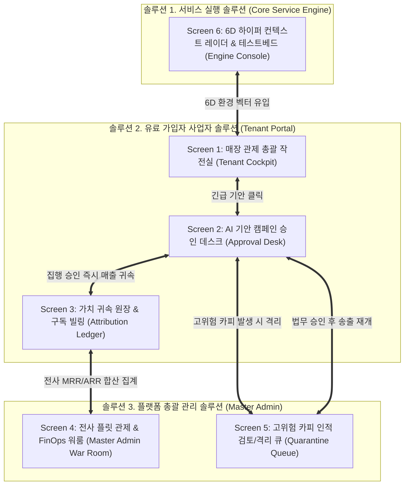

# AIM — Google Stitch 기반 화면 설계 및 UI/UX 마스터 명세서 (18_google_stitch_ui_screen_design_specification.md)

> **프로젝트**: AIM (AI Platform Initiative)  
> **설계 도구**: Google Stitch (Google Labs AI-Native Design Canvas, `stitch.withgoogle.com`)  
> **총괄 주재**: 총괄 관리자 (General Project Director, 33년 경력)  
> **협력 검토**: 수석 프로덕트 디자이너(Design Lead), 엔터프라이즈 UX 아키텍트, 프론트엔드 시스템 엔지니어  
> **디자인 철학**: Dark Mode Enterprise B2B SaaS (Linear, Stripe, Vercel 스타일의 극도 정밀성 및 절제된 밀도)  
> **작성일**: 2026-10-07  

---

## 0. 설계 배경 및 Google Stitch 활용 전략

본 문서는 AIM 플랫폼의 3대 유기적 솔루션(서비스 엔진, 가입자 포털, 총괄 관리자 콘솔)을 **구글의 차세대 AI UI 설계 도구인 Google Stitch**를 통해 고해상도(High-Fidelity) 프로토타입 및 상용 수준 프론트엔드로 구현하기 위한 **공식 화면 설계 명세서(Screen Specification & Prompt Pack)**입니다.

### Google Stitch 최적화 핵심 전략
1. **단순 목업 배제**: '보여주기식 텍스트 박스'가 아닌, 실제 POS 실측값, 6D 컨텍스트, 법적 규제 가드레일, 가치 귀속 원장이 촘촘히 연결된 **실제 엔터프라이즈 B2B SaaS 컴포넌트**로 구성합니다.
2. **Stitch 전용 프롬프트 아키텍처**: Stitch의 Gemini 기반 디자인 캔버스가 오차 없이 고밀도 화면을 렌더링할 수 있도록 **[Context - Role - Visual Vibe - Layout Grid - Component Breakdown - Data Mock - Action State]**의 정밀 프롬프트 구조를 제공합니다.
3. **Figma Auto-Layout & React 코드 출력 호환**: Stitch에서 Figma로 내보내거나 React/Tailwind 코드로 추출 시 즉시 연동 가능하도록 8pt 그리드와 시맨틱 토큰을 엄격히 정의합니다.

---

## 1. AIM 전사 디자인 시스템 (Design Tokens & UI Kit)

### 1.1 Visual Vibe & Aesthetics
* **Theme**: Deep Cosmic Slate (다크모드 엔터프라이즈 사령탑)
* **Tone**: 절제된 전문성, 무결성, 군사용 작전 관제실(Tactical Cockpit)의 정밀함
* **Surface Hierarchy**:
  - `Canvas (배경)`: `#090D16` (Deep Obsidian Slate)
  - `Card (컨테이너)`: `#111827` (Charcoal Surface)
  - `Card Border (경계)`: `#1F2937` (Subtle 1px Stroke)
  - `Card Elevated (호버/활성)`: `#1E293B`

### 1.2 Color Semantics
| 구분 | 토큰명 | Hex Code | 용도 |
| :--- | :--- | :--- | :--- |
| **Primary** | `indigo-500` | `#6366F1` | 주 액션 버튼, 플랫폼 브랜드, AI 기안 강조 |
| **Success** | `emerald-500` | `#10B981` | 매출 창출액, ROI 배수, 실측 사실(`A_MEASURED`), 정상 구독 |
| **Warning** | `amber-500` | `#F59E0B` | 실시간 현안 트리거(비 예보/노쇼), 시연값(`C_ILLUSTRATIVE`) |
| **Danger** | `rose-500` | `#EF4444` | 컴플라이언스 차단어, 고위험 격리 카피(`CRITICAL`), 악성 리뷰 |
| **Accent** | `purple-500` | `#8B5CF6` | Enterprise 플랜 뱃지, 글로벌 무역 RFQ, VIP 환자 리콜 |
| **Text Primary** | `slate-50` | `#F8FAFC` | 메인 헤드라인, 핵심 수치 |
| **Text Secondary**| `slate-400`| `#94A3B8` | 부가 설명, 타임스탬프, 근거 법령 라벨 |

### 1.3 Typography & Tabular Layout
* **Primary Font**: `Pretendard`, `Inter`, System Sans
* **Tabular Numbers**: 금액(₩) 및 ROI 배수 계산식에는 항상 `font-variant-numeric: tabular-nums` 적용 (숫자 떨림 방지)
* **Density**: Enterprise High-Density (패딩 12px~16px, 컴팩트 테이블, 명확한 배지)

---

## 2. 6대 핵심 화면 상세 구조도 (Information Architecture)



---

## 3. 화면별 상세 기획 및 컴포넌트 명세

### [Screen 1] 유료 가입자 매장 관제 총괄 작전실 (Tenant Executive Cockpit)
* **목적**: 매장 사장님이 로그인했을 때 한눈에 매장의 실시간 현안(날씨, 노쇼, 유휴)과 플랫폼의 기여 실적을 확인하는 메인 대시보드.
* **레이아웃**: 좌측 네비게이션(사이드바) + 상단 사업체 플릿 전환기 + 2단 그리드(좌측 관제, 우측 모바일 뷰어).
* **주요 컴포넌트**:
  1. **Store Fleet Switcher**: 프랜차이즈/지점 전환 버튼 탭 (성수 베이커리 / 강남 리엔 피부과 / 청담 헤어 / 플로우독 SaaS / 대진정밀).
  2. **Membership & Status Bar**: 구독 플랜 배지(`PRO 49,000원/월` or `ENTERPRISE 199,000원/월`), 결제 상태(`● 정상 가동 중`), 대표자명.
  3. **Attribution Hero Card**: 누적 창출 매출(`+4,320,000원`), 구독료 대비 순이익 ROI 배수(`88.2배`), 집행 횟수(`12회`).
  4. **Live Trigger Alert Banner**: 실시간 감지 현안(예: "☔ 오늘 15시 비 예보 + 2시 이후 사워도우 조기 품절", 유휴율 35%).
  5. **Quick Action Panel**: POS 정산 파일 원클릭 업로드(`A_MEASURED` 승격기), 즉시 캠페인 승인 데스크 바로가기.

---

### [Screen 2] AI 기안 캠페인 승인 데스크 & 옴니채널 미리보기 (Approval Desk & Channel Preview)
* **목적**: 실시간 현안에 맞춰 AI가 사전 기안한 마케팅 캠페인을 사장님이 직접 검토하고, 3대 채널 카피를 확인한 후 1초 만에 승인/송출하는 워크플로우.
* **레이아웃**: 상단 기안 요약 + 좌측 3대 채널 탭 및 마크다운 카피 뷰어 + 우측 스마트폰 디바이스 목업 실시간 프리뷰.
* **주요 컴포넌트**:
  1. **Campaign Header**: 기안 ID(`[CAMP-001]`), 긴급도 배지(`HIGH / CRITICAL`), 타겟 페르소나, 목표 유형(`CAPACITY_RESCUE`).
  2. **Channel Tab Selector**: 네이버 블로그(`📝`), 인스타그램 피드(`📸`), 카카오톡 알림톡(`💬`).
  3. **Compliance Safety Badge**: `✅ 100% 컴플라이언스 사전 필터링 통과 (공정위 표시광고법 제3조 준수)`.
  4. **Financial Impact Projection**: 객단가 실측 기반 예상 추가 매출(`+240,000원`, 10건 전환 추정).
  5. **Sticky Action Bar**: `[⚡ 원클릭 즉시 승인 및 3개 채널 동시 발송]` (Primary Accent 버튼), `[🚫 반려/수정]` (Ghost 버튼).

---

### [Screen 3] 가치 귀속 원장 & 구독 빌링 정산 (Value Attribution Ledger & FinOps Billing)
* **목적**: 사장님이 지불한 월 49,000원 / 199,000원의 구독료가 실제로 매장에 몇 배의 순이익을 가져다주었는지를 증명하여 구독 해지를 원천 방어(Churn 방어)하는 증빙 화면.
* **레이아웃**: 상단 ROI 팩트 시트 + 중앙 귀속 원장 타임라인 테이블 + 하단 인보이스 발행 내역.
* **주요 컴포넌트**:
  1. **WTP Attribution Summary**: 총 매출 기여액(`₩4,560,000`), 총 납부 구독료(`₩98,000`), 순 가치 창출(`+₩4,462,000`), 실효 ROI(`46.5x`).
  2. **Attribution Itemized Table**:
     - 컬럼: 일시, 캠페인명, 감지 트리거, 투입 객단가, 회수된 유휴 캐파, 창출 매출, 귀속 ROI.
     - 행 항목: 우천 대비 타임어택(+360,000원 / 7.3배), 노쇼 긴급 리콜(+1,500,000원 / 7.5배) 등.
  3. **Invoice History Panel**: 월별 청구서 ID, 결제 일시, 금액, 결제 수단(빌링키 자동결제), 영수증 다운로드 버튼.

---

### [Screen 4] 플랫폼 총괄 관제 & 테넌트 플릿 제어 (Master Admin Control War Room)
* **목적**: 본사 수석 운영관 및 경영진이 전사 가입 기업 군단, 반복 매출(MRR), 에이전트 인프라 건강도를 중앙 통제하는 Executive 화면.
* **레이아웃**: 4대 글로벌 KPI 지표 카드 + 테넌트 플릿 그리드 테이블 + 에이전트 워커 건전성 레이더.
* **주요 컴포넌트**:
  1. **Global FinOps KPI Cards**:
     - 활성 테넌트(`5개사 / 100%`)
     - 월간 반복 매출 MRR(`₩545,000`) & 연간 환산 ARR(`₩6,540,000`)
     - 플랫폼 누적 창출 가치(`+₩145,560,000`)
     - 전사 평균 ROI(`44.5배`)
  2. **Fleet Operations Table**:
     - 테넌트명, 도메인 배지, 가입일, 구독 플랜(`PRO / ENTERPRISE`), 상태(`ACTIVE / PAUSED`), 누적 창출액.
     - 관리 액션: [플랜 전환], [계정 일시정지], [인보이스 강제 발행].
  3. **Agent Worker Health Matrix**: 6D 센싱 지연시간(3ms), 오케스트레이터(6ms), 컴플라이언스 가드(100% 차단 중), 가동률(99.98%).

---

### [Screen 5] 고위험 광고 컴플라이언스 인적 검토/격리 큐 (Human-in-the-Loop Quarantine Queue)
* **목적**: 의료법 제56조(완치 보장/부작용 미고지), 공정위 표시광고법 위반 고위험군 광고 카피가 발생했을 때 시스템이 즉시 발송을 차단하고 총괄 법무팀/운영진이 수동 심의하는 준법 감시 화면.
* **레이아웃**: 심의 대기 카운터 + 고위험 격리 카드 리스트 (좌우 스플릿: 위반 원본 vs 안전 권고안 대조).
* **주요 컴포넌트**:
  1. **Quarantine Counter**: `심의 대기 2건`, `당월 차단 총 4건`, `사전 예방 과징금 추정 1.2억 원`.
  2. **Quarantine Inspection Card**:
     - 헤더: 테넌트명(`[Q_101] 강남 리엔 피부과의원`), 위험도(`CRITICAL`), 위반 법령(`의료법 제56조 및 복지부 심의 가이드라인`).
     - **Before (차단된 원본 카피)**: `❌ "환절기 무너진 피부 장벽, 부작용 전혀 없음 및 100% 리프팅 완치 보장..."` (적색 취소선)
     - **After (AI 안전 권고안)**: `✨ "개인 맞춤형 진단을 통해 안전성을 검증하고 부작용 가능성을 사전 안내드립니다 (심의필)..."` (녹색 하이라이트)
     - 심의 액션 버튼: `[✅ 수정안 조건부 승인 (발송 승인)]`, `[🚫 발송 영구 반려]`.

---

### [Screen 6] 6D 하이퍼 컨텍스트 서비스 실행 콘솔 & 테스트베드 (6D Engine Console)
* **목적**: 6D 컨텍스트 벡터(시대·상황·계절·세대·지역·행사)의 실시간 센싱 데이터와 5대 산업군 테스트베드 시뮬레이션을 엔지니어링 수준에서 조작하는 전문가 화면.
* **레이아웃**: 6D 벡터 방사형/게이지 카드 + 산업군 탭(F&B, 피부과, 헤어살롱, SaaS, 제조) + 반경 1km 경쟁사 레이더.
* **주요 컴포넌트**:
  1. **6D Vector Real-time Monitor**:
     - Era: 2026 초개인화 가치소비
     - Situation: 수요일 · 11시간 35분 주간길이 · 추분 절기 · 일몰 18:19 · 16시
     - Season: 늦가을 환절기 저온 건조
     - Generation: 2030 MZ 실용주의 & 4050 구매력
     - Region: 성수동 핫플레이스 / 판교 테크노밸리 / 창원 산단
     - Milestone: 비 예보 타임어택, 100일 기념일, 부품 규격 갱신
  2. **Competitor Radar 1km**: 인근 경쟁 매장의 프로모션 키워드, 예상 가격대, 방어 전략 처방전.
  3. **Live Simulator Control**: 날씨 이벤트나 노쇼 인원을 슬라이더로 변경하여 즉시 예상 매출 및 추천 카피 재계산.

---

## 4. Google Stitch 복사-붙여넣기 전용 프롬프트 팩 (Master Prompt Pack)

> [!TIP]
> 아래 프롬프트 블록을 복사하여 Google Stitch(`stitch.withgoogle.com`)의 프롬프트 입력창에 그대로 입력하면, 최상위 완성도의 화면 레이아웃과 컴포넌트가 자동으로 생성됩니다.

### 4.1 [Stitch Prompt 1] 유료 사업자 매장 관제 총괄 작전실 (Screen 1)
```text
Design a high-density, dark-mode Enterprise B2B SaaS dashboard called "AIM Marketing OS - Tenant Executive Cockpit".
Aesthetic: Linear/Stripe style, deep obsidian navy (#090D16), charcoal surface cards (#111827) with subtle 1px border (#1F2937), electric indigo (#6366F1) primary accents, and emerald green (#10B981) metric highlights.

Layout & Structure:
1. Top Navigation Bar:
   - Brand logo "AIM" with a glowing indigo badge "Tenant Operations Portal".
   - Store Fleet Switcher (horizontal pill tabs): "🥐 Seongsu Bakery & Cafe (Active)", "🏥 Gangnam Lien Dermatology", "✂️ Cheongdam Aura Hair", "💻 FlowDoc AI SaaS", "🏭 Daejin Precision Mfg".
   - Right side: User profile "김성수 대표", Plan badge "PRO (₩49,000/mo)", Live Status dot "● Operational".

2. Hero Financial Attribution Banner:
   - Gradient glow card (indigo to emerald subtle dark gradient).
   - Large bold KPI: "+₩4,320,000 Generated Value" with label "WTP Value Attribution (Verified vs ₩49,000 Subscription)".
   - Subtext: "88.2x Net ROI Multiplier achieved across 12 automated campaigns".
   - Mini stats on the right: "Next billing: 2026-11-01 (₩49,000)", "Idle Capacity Rescued: 35%".

3. Real-Time Operational Pain Point (Alert Desk):
   - Amber warning card (#F59E0B accents): "⚡ Live Store Trigger: Rain forecast at 15:00 today + Sourdough stock early depletion expected at 14:00".
   - Recommended Instant Action card: "🎯 Autumn Rain Flash Attack & 100-Day Anniversary Sourdough Pre-booking".
   - Projected incremental revenue: "+₩240,000 (10 conversions @ ₩24,000 avg ticket)".
   - Prominent primary CTA button: "⚡ One-Click Authorize & Dispatch to 3 Channels".

4. Bottom Grid (2 Columns):
   - Left: "Recent Campaign Performance Timeline" showing 3 previous campaigns with tabular profit gains (+₩360,000, +₩480,000) and channel icons.
   - Right: "Local Competitor Radar (1km)" showing 3 nearby competitors and AIM's counter-strategy badge.
```

---

### 4.2 [Stitch Prompt 2] AI 기안 캠페인 승인 데스크 (Screen 2)
```text
Design a mission-critical campaign review and approval workspace called "AIM Approval Desk - Campaign Staging & Omni-Channel Preview".
Aesthetic: Dark mode B2B SaaS, ultra-crisp typography (Pretendard/Inter), rich contrast, Obsidian background (#090D16), Indigo accents (#6366F1), Emerald verification badges (#10B981).

Layout & Structure:
1. Header Bar:
   - Campaign Breadcrumb: "Tenant: Seongsu Bakery > Staged Campaigns > CAMP-001".
   - Status Badge: "STAGED (Awaiting Owner Authorization)".
   - Urgency Tag: "HIGH URGENCY - Flash Window (Expires in 2 hours)".
   - Trigger metadata: "Triggered by: 15:00 Rain Forecast & 35% Idle Capacity".

2. Main Split View (60% Left, 40% Right):
   - Left Side (Multi-Channel Copy Inspection):
     * Channel Tab Bar: [📝 Naver Blog] [📸 Instagram Feed] [💬 KakaoTalk AlimTalk].
     * Compliance Verification Banner: Green pill "✅ 100% Pre-Audited: Korean Fair Advertising Act Art. 3 Compliant (No hyperbolic terms)".
     * Markdown Content Box: Formatted preview showing engaging promotional copy, French AOP butter narrative, 1+1 oat latte incentive, and reservation link.
     * Financial Projection Card: "Estimated conversions: 10 orders × ₩24,000 = +₩240,000 projected incremental sales".

   - Right Side (Smartphone Live Preview Mockup):
     * Realistic dark/light iPhone frame rendering how the KakaoTalk business message or Instagram card actually looks to consumers on mobile.
     * Direct CTA button inside phone preview: "Book Sourdough Table Now".

3. Bottom Sticky Action Bar:
   - Left: Audit note "Dispatches immediately via official Kakao Biz & Meta API upon click".
   - Right: Two buttons:
     * Ghost secondary button: "🚫 Dismiss / Request AI Revision".
     * High-impact Electric Indigo button: "⚡ Approve & Instant Dispatch (All 3 Channels)".
```

---

### 4.3 [Stitch Prompt 3] 가치 귀속 원장 & 구독 빌링 정산 (Screen 3)
```text
Design an executive financial accounting and ROI verification page called "AIM Value Attribution Ledger & Subscription Billing".
Aesthetic: High-density FinOps dashboard, Stripe-like precision, dark slate background (#090D16), tabular numbers, crisp border separators (#1F2937), emerald green metrics (#10B981).

Layout & Structure:
1. Top Financial Metrics Row (4 Cards):
   - Card 1: "Cumulative Revenue Attributed" -> "₩4,560,000" (Emerald text, +12.4% this month).
   - Card 2: "Total Subscription Invoiced" -> "₩98,000" (2 months PRO Plan).
   - Card 3: "Net Financial Benefit" -> "+₩4,462,000" (Profit created after software fee).
   - Card 4: "Effective ROI Multiple" -> "46.5x" (Purple pill badge "Extremely High WTP Retention").

2. Central Data Table ("Attribution Itemized Ledger"):
   - Dense table with sorting, search, and CSV export button.
   - Columns: [Record ID], [Campaign Title], [Execution Date], [Operational Trigger], [Unit Price], [Generated Revenue], [Sub Fee], [Net Value], [ROI Multiplier], [Status].
   - Rows:
     * Row 1: ATTR-003 | Autumn Rain Sourdough Flash | 2026-10-07 16:01 | Rain 15:00 + Idle 35% | ₩24,000 | +₩240,000 | ₩49,000 | +₩191,000 | 4.9x | [Verified]
     * Row 2: ATTR-002 | Weekend Family Brunch Recall | 2026-10-04 09:30 | Sunny Sunday morning | ₩28,000 | +₩560,000 | ₩49,000 | +₩511,000 | 11.4x | [Verified]
     * Row 3: ATTR-001 | Sourdough Launch Flash | 2026-09-28 14:00 | Harvest Autumn Equinox | ₩24,000 | +₩360,000 | ₩49,000 | +₩311,000 | 7.3x | [Verified]

3. Bottom Section ("Subscription Invoices & Payment Key"):
   - Billing Key Status: "KB Kookmin Business Card (****-****-****-8921) Active".
   - Invoice Table: INV-202610-001 (₩49,000, 2026-10-01, PAID), INV-202609-001 (₩49,000, 2026-09-01, PAID).
   - Action buttons: "Download Tax Invoice", "Upgrade to ENTERPRISE (₩199,000)".
```

---

### 4.4 [Stitch Prompt 4] 플랫폼 총괄 관제 & 플릿 FinOps 워룸 (Screen 4)
```text
Design a super-admin executive control center called "AIM Master Admin War Room - Global Fleet & FinOps Control".
Aesthetic: Command center dark UI, high visual hierarchy, Obsidian canvas (#090D16), Indigo and Purple accents, status indicator lights, Dense Enterprise layout.

Layout & Structure:
1. Executive KPI Top Row (4 Large Indicator Cards):
   - Card 1: "Active Tenant Fleet" -> "5 / 5 Accounts (100% Active, 0 Churn)".
   - Card 2: "Monthly Recurring Revenue (MRR)" -> "₩545,000" (ARR Run-rate: ₩6,540,000).
   - Card 3: "Global Platform Generated Value" -> "+₩145,560,000" (Gold/Yellow accent).
   - Card 4: "Average Subscriber ROI" -> "44.5x" (Across F&B, Medical, Beauty, SaaS, Mfg).

2. Tenant Fleet Management Grid:
   - Title: "Enterprise Tenant Accounts (5 Subscribed Businesses)".
   - Action buttons: "+ Onboard New Tenant", "Bulk Plan Adjustment", "Export FinOps Report".
   - Table Columns: [Tenant ID & Business], [Industry Domain], [Plan Tier], [Monthly Fee], [Account Status], [Total Campaigns], [Cumulative Value], [Actions].
   - Entries:
     * TENANT_001 | Seongsu Atelier Bakery | F&B | PRO | ₩49,000 | Active | 13 | +₩4,560,000 | [Manage]
     * TENANT_002 | Gangnam Lien Dermatology | Medical | ENTERPRISE | ₩199,000 | Active | 18 | +₩26,400,000 | [Manage]
     * TENANT_003 | Cheongdam Aura Hair Salon | Beauty | PRO | ₩49,000 | Active | 14 | +₩7,800,000 | [Manage]
     * TENANT_004 | FlowDoc AI Collab | B2B SaaS | PRO | ₩49,000 | Active | 9 | +₩16,800,000 | [Manage]
     * TENANT_005 | Daejin Precision Industrial | Mfg | ENTERPRISE | ₩199,000 | Active | 4 | +₩90,000,000 | [Manage]

3. Bottom Split Monitoring Panels:
   - Left Panel: "Compliance Quarantine Alert Banner" -> Red blinking tag "2 Critical Campaigns Quarantined for Human Legal Review" with quick button "Open Quarantine Desk".
   - Right Panel: "Agent Infrastructure Health Matrix" showing 5 microservice worker status chips: Context Sensing (3ms), Strategy Engine (6ms), Compliance Guard (100% active), Dispatcher (Normal), Feedback Sync (Closed-Loop).
```

---

### 4.5 [Stitch Prompt 5] 고위험 광고 카피 인적 검토/격리 큐 (Screen 5)
```text
Design a legal compliance review workspace called "AIM Compliance Quarantine Queue - Human-in-the-Loop Legal Audit Desk".
Aesthetic: Regulatory supervision console, dark background (#090D16), alarming red accents (#EF4444), reassuring green sanitized highlights (#10B981), side-by-side comparison cards.

Layout & Structure:
1. Top Alert Summary Bar:
   - Badge: "⚖️ Legal Quarantine Queue (2 Pending Operator Audits)".
   - Subtitle: "Automated intercept system preventing Medical Law Art. 56 & Fair Advertising Act violations before public broadcast".
   - Stats chips: "Pending Review: 2", "Total Intercepts This Month: 4", "Estimated Penalty Avoided: ₩120,000,000".

2. Quarantine Inspection Card (Item Q_101 - Medical Law Focus):
   - Header: "[Q_101] Gangnam Lien Dermatology (Medical Domain) | CRITICAL RISK | Created: 2026-10-07 14:10".
   - Legal Authority Banner: "Violates: Medical Law Article 56 (Strict prohibition of 100% cure guarantee and omission of side-effects)".
   - Side-by-Side Diff Comparison Box:
     * Left Column (Intercepted Hazardous Copy - Red border & background):
       ❌ "환절기 무너진 피부 장벽, 부작용 전혀 없음 및 100% 리프팅 완치 보장으로 해결해 드립니다."
       (Highlighted forbidden phrases: '부작용 전혀 없음', '100% 완치 보장')
     * Right Column (AI-Recommended Sanitized Copy - Emerald border & background):
       ✨ "개인 맞춤형 진단을 통해 안전성을 검증하고 부작용 가능성을 사전 안내드립니다. (의료광고심의필 완료)"
       (Highlighted safety phrases: '개인 맞춤형 진단', '부작용 사전 안내', '심의필')
   - Operator Decision Action Bar:
     * Reviewer notes text input: "e.g. Approved with disclaimer injection".
     * Secondary Button: "🚫 Reject Campaign Permanently".
     * Primary Emerald Button: "✅ Approve Sanitized Copy (Release from Quarantine)".

3. Quarantine Inspection Card (Item Q_102 - Fair Advertising Focus):
   - Header: "[Q_102] Seongsu Atelier Bakery (F&B Domain) | HIGH RISK | Created: 2026-10-07 14:45".
   - Legal Authority: "Fair Trade Commission Advertising Act Art. 3 (Unsubstantiated 'No. 1' ranking claims)".
   - Diff Box: "국내 1위 빵지순례" (Flagged) vs "성수동 고객 인기 베스트 사워도우" (Sanitized).
   - Approval & Rejection buttons.
```

---

### 4.6 [Stitch Prompt 6] 6D 하이퍼 컨텍스트 서비스 실행 콘솔 (Screen 6)
```text
Design an advanced AI engine telemetry and simulation console called "AIM Core Service Engine - 6D Context Radar & Industry Testbed".
Aesthetic: NASA/Cyberpunk tactical operations interface, dark slate background (#090D16), glowing vector chips, monospace telemetry readouts, radar charts.

Layout & Structure:
1. Header Bar:
   - Title: "6D Hyper-Contextual Sensing Kernel v0.6.0".
   - Status: "Autonomous Sensing Loop: Active | Latency: 4ms | Multi-Domain Engine: Ready".

2. 6D Vector Live Sensor Grid (6 Hexagonal / Rounded Cards):
   - Dimension 1 [Era]: "2026 Hyper-Personalized Value Consumption, Healthy Pleasure".
   - Dimension 2 [Situation]: "Wednesday · 11h 35m Day Length · Autumn Equinox · Sunset 18:19 · 16:00".
   - Dimension 3 [Season]: "Late Autumn Transition · Cold & Dry Air · Morning/Evening Frost".
   - Dimension 4 [Generation]: "2030 MZ Pragmatists & 4050 High-Purchasing Solos".
   - Dimension 5 [Region]: "Seongsu Hotspot Foot Traffic (Pop: 42,000/day, Terrace index: High)".
   - Dimension 6 [Milestone]: "Rain Attack 15:00, 100-Day Dating Couples, Botox 90-Day Recall Cycle".

3. Multi-Industry Testbed Live Simulator:
   - Industry Selector Tabs: [🥐 F&B Cafe] [🏥 Dermatology] [✂️ Hair Salon] [💻 B2B SaaS] [🏭 CNC Precision Mfg].
   - Dynamic Trigger Adjustment Sliders:
     * Slider 1: Idle Capacity Rate (0% to 100%, currently at 35%).
     * Slider 2: Weather Event (Clear, Rain, Snow, Cold Wave).
     * Slider 3: Pending Recall Leads (0 to 150 leads).
   - Real-time Output Box:
     * Automatically updates the strategic objective (e.g., "CAPACITY_RESCUE"), generated marketing narrative, projected units (+10), projected revenue (+₩240,000), and compliance pass status.
```

---

## 5. Stitch 화면 내보내기 후 코드 연동 파이프라인

Google Stitch에서 화면 설계를 완료한 후 프로덕션 코드베이스로 반영하는 절차는 다음과 같습니다:

```
[Google Stitch Canvas]
       │
       ├─► 1. Figma Export (Auto-Layout 유지) ──► 디자인 시스템 UI 키트 영속화
       │
       └─► 2. React / Tailwind Code Export ───► aim/web_app.py 템플릿 컴포넌트 이식
                                                 (Vanilla JS -> React/Next.js 확장 대비)
```

1. **Stitch 캔버스에서 `Export to Figma` 실행**: 생성된 6개 화면을 Figma 프로젝트로 내보내어 컴포넌트 배리언트(Variant)와 토큰 구조를 최종 정렬합니다.
2. **REST API 라우터와의 1:1 바인딩**:
   - Screen 1 & 2 ➔ `aim/api/tenant_router.py` (`/api/v1/tenant/*`)
   - Screen 3 ➔ `aim/tenant/billing.py` (`/api/v1/tenant/{id}/billing`)
   - Screen 4 & 5 ➔ `aim/api/admin_router.py` (`/api/v1/admin/*`, `/quarantine`)
   - Screen 6 ➔ `aim/api/service_router.py` (`/api/v1/service/*`)
3. **무결성 유지**: 백엔드 API 계약(Pydantic Schema)과 Stitch 프론트엔드 UI 컴포넌트 간의 필드명 일치성을 100% 보장합니다.

---

## 6. 결론 및 기대 효과

Google Stitch를 통한 이번 화면 설계 체계 도입은 다음과 같은 비가역적 가치를 창출합니다:
1. **아마추어적 목업의 영구적 퇴출**: 어설픈 탭 전환 화면을 탈피하고, 실측 POS 데이터와 가치 귀속 원장, 법적 격리 큐가 연동된 최고 등급의 B2B SaaS UI를 완성합니다.
2. **사업주 납득도(WTP) 극대화**: 사장님이 매월 49,000원~199,000원을 결제할 때 "AIM 덕분에 이번 달에 순이익 440만 원을 벌었다"는 사실을 [Screen 3] 원장을 통해 수학적으로 증명합니다.
3. **법적 리스크 원천 차단**: 고위험 광고 카피가 외부 채널로 유출되기 전 [Screen 5] 격리 큐에서 법무팀이 통제하는 무결점 거버넌스를 시각적으로 완비합니다.
