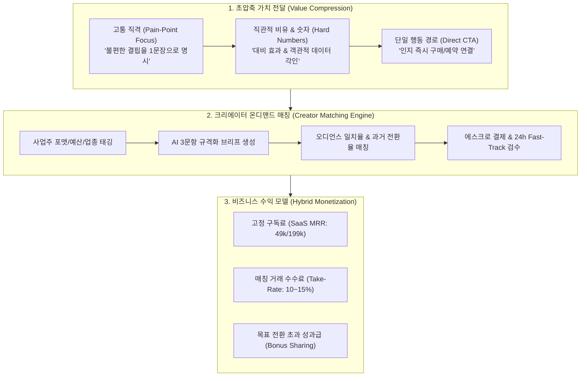
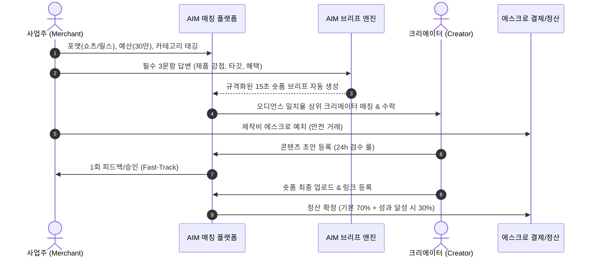
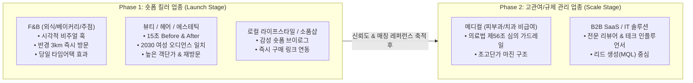

# AIM — 가치 압축 전달 전략 및 인플루언서 온디맨드 매칭 아키텍처 (20_creator_matching_and_value_compression_architecture.md)

> **프로젝트**: AIM (AI Platform Initiative)  
> **핵심 주제**: 
> 1. 상품 가치의 초압축 전달 (단순성·즉각성·단일 CTA)  
> 2. 사업주 니즈 기반 크리에이터 온디맨드 매칭 플랫폼 구조 분석  
> 3. 수익 모델(하이브리드 SaaS + Take-Rate) 및 타깃 업종군 전략 로드맵  
> **작성일**: 2026-10-08  
> **준수 원칙**: 안드레 카파시 개발 4원칙 (Think Before Coding, Simplicity First, Surgical Changes, Goal-Driven Execution)

---

## 1. 전략적 배경 및 가치 제안 (Executive Summary)

소비자의 정보 처리 한계와 숏폼(Short-form) 미디어 환경의 가속화로 인해, 장황한 기능(Feature) 나열형 마케팅은 전환율을 급격히 떨어뜨립니다.  
AIM은 **"소비자에게는 3초 내 가치를 직격하는 초압축 메시지"**를 전달하고, **"사업주에게는 복잡한 기획 공수 없이 최적의 크리에이터를 연결하는 온디맨드 매칭 인프라"**를 유기적으로 통합합니다.

---

## 2. 가치 전달의 핵심 원리: 단순성과 즉각성 (Value Compression Engine)

### 2.1. 3대 원칙 세부 명세

| 원칙 | 기존 마케팅의 패착 | AIM 가치 압축 방식 | 실사례 (F&B / 뷰티) |
| :--- | :--- | :--- | :--- |
| **① 고통 해결 중심 (Pain-Point Focus)** | 우리 매장의 원두 원산지, 인테리어의 아름다움 등 공급자 중심 기능 나열 | 소비자가 지금 겪는 가장 아픈 결핍과 짜증을 1문장으로 지목하고 즉각적 해방감 제시 | *"비 오는 날 눅눅한 빵에 실망하셨나요? 오븐에서 방금 나온 바삭한 크루아상이 3분 거리에 있습니다."* |
| **② 직관적 비유와 숫자 (Metaphor & Numbers)** | "정성을 다한 최고의 시술", "합리적인 가격" 등 추상적 미사여구 | 구체적 수치와 감각적 비유, 극적인 대비(Contrast)를 통해 뇌리에 잔존율 극대화 | *"시술 후 90일간 노쇼율 0%, 재방문 만족도 96.4%. 150만원 대행사 대신 월 49,000원의 마케팅 실장."* |
| **③ 단일 행동 유도 (Direct Single CTA)** | 홈페이지 둘러보기, 인스타 팔로우, 매장 위치 확인 등 다중 선택지로 인한 이탈 | 인지 즉시 구매/예약/쿠폰 다운로드로 이어지는 단일 버튼만 배치 | *"오늘 15시 한정 [원클릭 20% 타임어택 쿠폰 받기]" (추가 링크 일절 배제)* |

---

## 3. 사업주 니즈 기반 크리에이터 매칭 서비스 모델 (On-Demand Creator Matching)

### 3.1. 4단계 매칭 아키텍처

### 3.2. 3대 성공 필수 조건 (Critical Success Factors)

1. **AI 규격화 브리프 (Standardized Brief Generator)**:
   - 자영업자는 전문 마케팅 기획서를 쓸 시간과 역량이 부족함.
   - 단 3가지 질문(`Q1. 오늘 가장 팔고 싶은 상품`, `Q2. 손님이 경험할 단 하나의 혜택`, `Q3. 우리 손님의 주 연령/성별`)에 답하면, **[3초 후킹 카피 + 15초 숏폼 씬 구성(Hook-Body-CTA) + 법적 주의사항]**이 포함된 표준 브리프를 5초 만에 생성.
2. **성과 데이터의 투명성 (True Audience Metric Engine)**:
   - 허수 지표인 '단순 구독자 수(Vanity Metric)'를 철저히 배제.
   - 실제 시청자 연령/성별 일치율, 시청 지속 시간(Retention Graph), 과거 진행 캠페인의 **실제 전환율(Conversion Rate, 클릭/방문/구매)**을 지표화하여 매칭 스코어 산출.
3. **초단기 검수 프로세스 (Fast-Track SLA & Standard Terms)**:
   - 숏폼 트렌드는 주 단위로 변하므로 다단계 수정 요구는 크리에이터와 사업주 모두를 지치게 만듦.
   - 표준 약관: 수정 요청은 **1회 한정**, 피드백 기한은 **24시간 이내**, 미응답 시 자동 승인 및 송출 정책 적용.

---

## 4. 수익 모델(Monetization) 및 타깃 업종군 전략 분석

### 4.1. 수익 모델 분석: "단순 수수료 vs 구독제"의 트레이드오프와 최적 해법

| 모델 구분 | 장점 | 단점 및 리스크 | AIM 채택 여부 |
| :--- | :--- | :--- | :---: |
| **A. 순수 거래 수수료만 적용** (Transaction Fee Only) | 사업주의 초기 진입 장벽이 낮음 | 거래가 발생하지 않는 비수기 매출 불안정. 사업주-크리에이터 간 장외 직거래(탈플랫폼) 발생 리스크 매우 높음. | ❌ 비추천 |
| **B. 순수 월 구독제만 적용** (Subscription Only) | 예측 가능한 정기 반복 매출(MRR) 확보 | 고액의 크리에이터 협찬비 거래가 오갈 때 플랫폼의 부가가치(Take-Rate) 흡수 불가. | ❌ 비추천 |
| **C. 하이브리드 투트랙 모델 (SaaS MRR + Marketplace Take-Rate)** | **안정적 고정 수익과 폭발적 거래 수수료를 동시 확보.** 구독자에게 중개 수수료 할인 혜택을 주어 플랫폼 락인(Lock-in) 극대화. | 시스템 복잡도(결제/에스크로) 소폭 증가 | **⭐ 최적 권고안 (채택)** |

#### 💡 AIM 하이브리드 수익 모델 상세 구조:
1. **기반 SaaS 구독료 (Platform Access Fee)**:
   - **Pro 플랜 (월 49,000원)**: AI 가치 압축 엔진, 자동 브리프 생성, 로컬 레이더 무제한.
   - **Enterprise 플랜 (월 199,000원)**: 다매장 통합 관리, 전담 매칭 매니저, 고급 성과 리포트.
2. **마켓플레이스 매칭 중개 수수료 (Take-Rate)**:
   - 일반 거래: 제작 예치금의 **15%**
   - 유료 구독자 우대: 제작 예치금의 **10%** (5%p 할인으로 구독 유지 명분 제공)
3. **성과 연동 보너스 정산 (Performance-based Incentive, 옵션)**:
   - 목표 조회수/전환율(ROAS) 초과 달성 시 인센티브의 20%를 플랫폼 수수료로 수취 (나머지 80%는 크리에이터 귀속).

---

### 4.2. 타깃 업종군(Target Segments) 단계별 로드맵

크리에이터 매칭과 숏폼 압축 가치 전달은 **'시각적 즉각성'**과 **'의사결정 속도'**가 빠른 업종부터 공략해야 실패 확률이 없습니다.

1. **Phase 1 최우선 타깃: F&B 외식업 및 뷰티 살롱**
   - **선정 이유**: 
     - 소비자의 구매 결정 시간이 3분 이내로 매우 짧음.
     - 숏폼(음식 치즈 늘어남, 헤어 스타일 변화)의 시각적 파급력이 압도적임.
     - 마이크로 크리에이터(팔로워 5천~3만) 섭외 단가(10만~30만원)가 저렴하여 사업주 결제 허들이 낮음.
2. **Phase 2 확장 타깃: 메디컬(피부과) 및 B2B IT 솔루션**
   - **선정 이유**: 
     - 메디컬은 객단가가 수십만~수백만 원으로 높으나, **의료법 제56조(치료경험담 게재 금지, 부작용 미고지 금지)** 컴플라이언스 엔진이 결합된 브리프가 필수적임.
     - AIM의 기존 다중 규제 가드레일(`ComplianceEngine`)이 타사 대비 독점적 경쟁 우위를 형성함.

---

## 5. 결론 및 향후 시스템 구현 범위

1. **엔진 모듈 확장**:
   - `aim/core/value_compressor.py`: Pain-Point 직격, 수치/비유 정량화, 단일 CTA 포매터 구현.
   - `aim/core/brief_generator.py`: 사업주 3문항 입력 기반 표준 숏폼 브리프 자동 생성기.
   - `aim/matching/creator_network.py`: 오디언스 적합도 기반 매칭 및 에스크로 정산 모델.
2. **마스터 관제 포털 연동**:
   - 사업주 포털: [크리에이터 숏폼 의뢰] 탭 및 3문항 브리프 생성 UI.
   - 총괄 관리 콘솔: [매칭 현황 및 에스크로 수수료(MRR+Take Rate)] 통합 모니터링.
